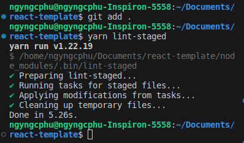

# Set up Front-end development environment (Part 1)
<figure markdown>

{ width="300" }
</figure>

Bài viết này dựa trên những kinh nghiệm mà mình học được khi tham gia vào một dự án tại TickLab với vai trò là Front-end developer. Nội dung chia sẻ bao gồm việc cài đặt, cấu hình môi trường phát triển giao diện người dùng trên nền tảng web từ lúc project bắt đầu vào giai đoạn hiện thực và cách làm việc nhóm hiệu quả giữa các thành viên trong team để đảm bảo chất lượng mã nguồn. Bạn đọc tạo issue trên [github repository](https://github.com/ngyngcphu/react-template) của mình nếu có bất cứ thắc mắc hay góp ý gì đến bài viết nhé.

<!-- more -->

## 1. Sơ lược về các công cụ sử dụng

- ReactJS là một thư viện JavaScript, được dùng để xây dựng giao diện người dùng linh hoạt và dễ tái sử dụng ([https://react.dev/](https://react.dev/)).
- TailwindCSS là một framework CSS mạnh mẽ cho phép xây dựng giao diện nhanh chóng và dễ dàng ([https://tailwindcss.com/](https://tailwindcss.com/)).
- Vite là một front-end build-tool nhanh và hiệu quả giúp tăng tốc quy trình phát triển ([https://vitejs.dev/](https://vitejs.dev/)).
- Zustand là một thư viện quản lý trạng thái cho ReactJS, giúp việc quản lý trạng thái ứng dụng một cách đơn giản và dễ dàng ([https://zustand-demo.pmnd.rs/](https://zustand-demo.pmnd.rs/)).
- TypeScript là một ngôn ngữ lập trình phổ biến, là một phiên bản mở rộng của JavaScript với hỗ trợ kiểu dữ liệu tĩnh, giúp giảm lỗi và nâng cao hiệu suất phát triển ([https://www.typescriptlang.org/](https://www.typescriptlang.org/)).
- ESLint, Prettier, Lint-staged, Husky: Bộ công cụ kiểm tra và duy trì chất lượng mã nguồn trong quá trình phát triển phần mềm. Các công cụ này giúp đảm bảo mã nguồn tuân thủ các quy tắc và tiêu chuẩn viết mã, tạo ra mã dễ đọc, dễ bảo trì và dễ cộng tác.

## 2. Bắt đầu với một ví dụ đơn giản

Mục tiêu của bài viết là giới thiệu cách cài đặt môi trường phát triển giao diện người dùng, không đi sâu vào việc hiện thực sản phẩm. Các bạn có thể tự mình hoàn thiện project nhỏ này dựa trên template mà chúng ta sẽ xây dựng.

Giả sử bạn có một yêu cầu xây dựng giao diện của một ứng dụng quản lý trên nền tảng web hiển thị các project đã và đang được làm trong một công ty. Sau khi phân tích nghiệp vụ, có được các requirement như sau:

- Ứng dụng gồm 3 trang: trang đăng nhập, trang hiển thị tổng quan tất cả các project và trang hiển thị thông tin chi tiết của mỗi project.
- Ứng dụng phải bao gồm 4 thao tác cơ bản: tạo - xem - sửa - xóa.
- Ứng dụng phải tương thích trên các màn hình desktop, mobile.

Tiếp theo, bạn cần tạo môi trường phát triển cho các developers trong team. Ở đây mình chỉ giới thiệu cách cài đặt các cấu hình cần thiết và tạo cấu trúc thư mục cho việc phát triển Front-end, các API từ Back-end sẽ được mock bằng cách đơn giản trả về chuỗi string mà không hiện thực chi tiết. 

## 3. Cài đặt và cấu hình môi trường phát triển

### 3.1. Cài đặt

- Vì chúng ta đang làm việc với Typescript nên cần phải có một runtime environment và một package manager. Mình chọn 2 công cụ phổ biến nhất là **node.js** và **yarn.** Các bạn vào trang chủ của node.js ([https://nodejs.org](https://nodejs.org/)) để cài đặt node, một trình quản lý gói **npm** cũng được cài kèm với node. Bạn có thể sử dụng luôn npm để thay thế cho yarn nhưng yarn sử dụng cache hiệu quả hơn để lưu trữ các gói đã tải, giúp tiết kiệm thời gian và băng thông khi cài đặt lại. Cài đặt yarn bằng command line:
    
    ```jsx
    npm install -g yarn
    ```
    
- Kiểm tra lại các công cụ đã cài đặt:
    
    
    
- Tiếp theo, chúng ta cần một base template từ Vite, sử dụng command line sau:
    
    ```jsx
    yarn create vite react-template --template react-ts
    ```
    
    Ta sẽ có một thư mục **react-template,** xóa các file: App.css, .eslintrc.cjs. Cấu trúc thư mục như sau:
    
    

### 3.2. Cấu hình

Sau mỗi bước cấu hình, các bạn có thể xem lại cấu trúc thư mục tương ứng với từng commit của mình trên [github](https://github.com/ngyngcphu/react-template) nhé.

1. **Cấu hình CSS framework**
    
    Chúng ta sử dụng TailwindCSS cho project. Tailwind được thiết kế theo nguyên tắc utility-first, bao gồm một tập hợp các class element sẵn có giúp cho việc phát triển front-end nhanh và linh hoạt. Sử dụng Tailwind một cách khéo léo, thậm chí không cần phải viết một file css thuần nào trong project cả, các bước cài đặt như sau:
    
    - Install **tailwindcss** qua yarn và tạo một `tailwind.config.js` file (lưu ý nên cài tailwindcss ở **devDependencies** của project vì các class element trong Tailwind sẽ được generate thành các file CSS tĩnh trước khi chạy trên trình duyệt):
    
        ```jsx
        yarn add -D tailwindcss
        yarn tailwindcss init
        ```
    
    - Thêm đường dẫn đến các file sử dụng tailwind trong `tailwind.config.js` :
        
        ```js
        /** @type {import('tailwindcss').Config} */
        export default {
          content: ['./index.html', './src/**/*.{js,ts,jsx,tsx}'],
          theme: {
            extend: {},
          },
          plugins: [],
        }
        ```
        
    - Thêm các chỉ thị `@tailwind` cho từng layer của Tailwind vào tệp `index.css` để kích hoạt và sử dụng các lớp CSS đã được định nghĩa sẵn trong Tailwind CSS framework. Cụ thể, có ba lớp chính cần thêm chỉ thị `@tailwind`, tham khảo [tại đây](https://tailwindcss.com/docs/functions-and-directives), lưu ý xóa toàn bộ nội dung cũ trong file `index.css` và chỉ cần thêm 3 chỉ thị tailwind:
        
        ```css
        @tailwind base;
        @tailwind components;
        @tailwind utilities;
        ```
        
    - Thử generate file CSS tĩnh từ 3 chỉ thị trong file `index.css`:
        
        ```jsx
        yarn tailwindcss -i ./src/index.css -o ./dist/output.css
        ```
        
        Ta sẽ thấy một folder `dist` xuất hiện chứa file `output.css` là một file CSS tĩnh được generate từ tailwind. Ta import `dist/output.css` vào file App.tsx, đồng thời xóa toàn bộ nội dung cũ và thay bằng đoạn code đơn giản sau:
        
        ```ts
        import '../dist/output.css';
        function App() {
          return (
            <h1 className="text-3xl font-bold underline">
              Hello world!
            </h1>
          );
        }
        
        export default App;
        ```
        
        Thực thi command line `yarn dev`, mặc định yarn sử dụng port 5173 để host website của chúng ta ở local, mở trình duyệt web tại địa chỉ `localhost:5173` và đây là kết quả:
        
        
        
        Ta nhận thấy quá trình từ lúc viết các class tailwindcss đến lúc render ra được UI khá thủ công: phải generate ra file CSS tĩnh, sau đó import nó vào từng file code có sử dụng tailwindcss. Nếu project chúng ta có tầm 50 file code `.tsx` có sử dụng tailwindcss, ta phải import 50 lần dòng `import '../dist/output.tsx'`, nhưng không phải file nào cũng dùng toàn bộ các class đã được generate, điều này làm chậm quá trình tải trang và tạo ra các mã CSS không cần thiết. Thêm vào đó, các mã CSS do tailwindcss sinh ra có thể không tương thích với một vài trình duyệt cũ như Safari, Internet Explorer,…Chính vì vậy, ta cần phải sử dụng các CSS processor để tự động và tối ưu hóa quá trình này, hai CSS processor được sử dụng là **postcss** và **autoprefixer**. Cài đặt chúng ở devDependencies :
        
        ```jsx
        yarn add -D postcss autoprefixer
        ```
        
    - Thêm file `postcss.config.js` tại root folder với nội dung như sau:
        
        ```js
        export default {
          plugins: {
            tailwindcss: {},
            autoprefixer: {},
          },
        }
        ```
        
        Ta đã cấu hình taiwindcss và autoprefixer là các plugin của postcss, thêm class `text-red-500` vào đoạn code Hello world! ở trên, chạy lại lệnh `yarn dev` để thấy kết quả:
        
        
        
        Thậm chí chúng ta không cần chạy lệnh `yarn tailwindcss -i ./src/index.css -o ./dist/output.css` và  `import '../dist/output.css'` ở từng file có sử dụng tailwindcss, vite sẽ automate quá trình này dựa vào file `postcss.config.js`, xóa bỏ folder `dist` và bây giờ chỉ cần Ctrl+S sau mỗi lần cập nhật các class tailwindcss.
        
2. **Cấu hình Code Quality Toolset (eslint, prettier, lint-staged, husky)**
    
    Trong cùng một dự án, các thành viên trong nhóm có thể có cách viết mã riêng. Sử dụng bộ công cụ này giúp đảm bảo mọi người viết mã theo cùng một quy tắc, từ định dạng mã đến quy tắc viết mã. Điều này làm cho mã nguồn dễ đọc hơn và giảm nguy cơ có những sai sót đơn giản.
    
    1. **Prettier**
        - Là một công cụ định dạng mã tự động và đồng nhất hóa cú pháp mã. Prettier giúp đảm bảo mã nguồn có cùng một cấu trúc, dấu cách và cú pháp, tạo ra mã đẹp và dễ đọc, tham khảo [tại đây](https://prettier.io/). Cài đặt `prettier` ở devDependencies:
            
            ```jsx
            yarn add -D --exact prettier
            ```
            
        - Tạo file `.prettierrc` để cấu hình prettier với các rule cơ bản như sau:
            
            ```js
            {
                "printWidth": 100,      // ensure that lines of code are no longer than 100 characters.
                "singleQuote": true,    // require Prettier to use single quotes (') instead of double quotes (") to wrap around strings.
                "jsxSingleQuote": true, // similar to the above, but applicable to JSX (JavaScript XML) as well.
                "semi": true,           // require Prettier to add semicolons (;) at the end of each line of code.
                "tabWidth": 2,          // specify that Prettier will use 2 spaces for each tab.
                "bracketSpacing": true, // add a space after the opening curly brace '{' and before the closing curly brace '}'.
                "arrowParens": "always",// require Prettier to always place parentheses around the parameter of an arrow function.
                "trailingComma": "none" // specify that Prettier won't add a trailing comma in multi-line lists like arrays or objects.
            }
            ```
            
        - Tạo file `.prettierignore` để Prettier biết các file nào không cần định dạng:
            
            ```js
            dist
            node_modules
            package*.json
            *.lock
            *.yml
            *.md
            ```
            
        - Ta định dạng file App.tsx bằng command line `yarn prettier ./src/App.tsx --write` hoặc thêm một script command cho toàn bộ project trong file package.json `"format": "prettier '**/*.{tsx,ts,js,json,md,yml,yaml}' --write"`.

    2. **ESLint**
        - Là một công cụ kiểm tra lỗi mã nguồn và quy tắc viết mã trong JavaScript và TypeScript, giúp phát hiện và sửa các lỗi cú pháp, logic và code convention trong mã nguồn, tham khảo [tại đây](https://eslint.org/). Cài đặt `eslint` cùng với `eslint-config-prettier` (dùng để tắt các quy tắc không cần thiết hoặc xung đột với prettier) và một plugin của eslint là `eslint-plugin-react-hooks` (dùng khi sử dụng các react hooks và cần tuân theo Rules of Hooks) và  ở devDependencies:
            
            ```jsx
            yarn add -D eslint eslint-config-prettier eslint-plugin-react-hooks
            ```
            
        - Tạo file `.eslintrc` để cấu hình eslint, thêm các rules, biến môi trường và các plugins cơ bản sau:
            
            ```js
            {
              "parser": "@typescript-eslint/parser",          // specify that the TypeScript ESLint parser should be used to analyze TypeScript code.
              "extends": [
                "prettier",                                   // integrate Prettier with ESLint for code formatting.
                "plugin:@typescript-eslint/recommended",      // provide recommended rules for TypeScript code from the @typescript-eslint plugin.
                "plugin:react-hooks/recommended"              // provide recommended rules for using React hooks.
              ],
              "plugins": ["@typescript-eslint"],              // configuration uses the @typescript-eslint plugin.
              "parserOptions": {
                "ecmaVersion": 2018,                          // specify that the code is written in ECMAScript 2018 (ES9).
                "sourceType": "module",                       // indicate that the code is using modules (ES6 modules).
                "project": "./tsconfig.json"                  // specify the TypeScript project configuration file to use.
              },
              "env": {
                "node": true,                                 // indicate that the code will run in a Node.js environment.
                "es6": true                                   // indicate that ES6 (ECMAScript 2015) features are supported.
              },
              "rules": {
                "@typescript-eslint/no-inferrable-types": 0,  // turn off the rule that flags unnecessary type declarations in TypeScript.
                "@typescript-eslint/no-unused-vars": 2,       // set the rule that enforces no-unused-vars to an error level.
                "@typescript-eslint/no-var-requires": 0,      // turn off the rule that disallows the use of require in TypeScript files.
                "eqeqeq": "error"                             // enforce strict equality (===) over loose equality (==) and sets it to an error level.
              }
            }
            ```
            
            Vì cấu hình project trong parserOptions nằm ở file `tsconfig.json` nên ta có những thay đổi ở file này để tương thích với ESLint như sau:
            
            - Bỏ các Linting trong compilerOptions vì đã có ESLint.
            - Thay đổi đường dẫn file trong `include` để chỉ định Typescript Compiler chỉ cần biên dịch các file sau:
              
                ```js
                "include": ["src", "**/*.ts", "**/*.tsx", "**/*.js", "*.cjs"]
                ```
            
            - Thay đổi tên các đuôi `*.config.js` (tailwind.config.js, postcss.config.js) thành đuôi `*.config.cjs` (tailwind.config.cjs, postcss.config.cjs) cho phù hợp với các đường dẫn file trong mục `include` (đồng nghĩa với việc thay đổi syntax từ ESModule sang CommonJS).
            - Một vài thay đổi khác đã được thực hiện trong compilerOptions nhưng không trình bày cụ thể tại đây, các bạn xem tại [commit](https://github.com/ngyngcphu/react-template/commit/d72437d8c64dd3b493cab238c00ed2680d6124c0) này của mình trên github nhé.
        - Tạo file `.eslintignore` để ESLint biết các file nào không cần kiểm tra:
            
                ```js
                dist
                node_modules
                ```
            
        - Ta chạy eslint file App.tsx bằng command line `yarn eslint ./src/App.tsx --fix` hoặc thêm một script command cho toàn bộ project trong file package.json `"lint": "eslint '**/*.{tsx,ts,js}' --fix"`.

    3. **Lint-staged**
        - Hai tool ở trên có thể đã đủ dùng cho chúng ta định dạng code, kiểm tra cú pháp, kiểm tra code convention nhưng có một nhược điểm. Đó là chúng đều chạy trên toàn bộ source code dù ta chỉ thay đổi duy nhất 1 file, gây tốn thời gian và resource của máy. Vì vậy, ta dùng thêm một tool nữa là **lint-staged**, tool này giới hạn phạm vi Prettier và ESLint chỉ trên những file nằm trong vùng **staging** của git (những file được **git add**), tham khảo [tại đây](https://github.com/okonet/lint-staged). Cài đặt `lint-staged` ở devDependencies:
            
            ```jsx
            yarn add -D lint-staged
            ```
            
        - Tạo file `.lintstagedrc.json` để giới hạn phạm vi của prettier và eslint:
            
            ```js
            {
              "**/*.{ts,js,tsx}": ["eslint --fix"],
              "**/*.{tsx,ts,js,json,md,yml,yaml}": ["prettier --write"]
            }
            ```
            
        - Trước khi chạy lint-staged, ta phải đưa các file đã thay đổi vào staging của git, kết quả như sau:
            
            
            
    4. **Husky**
        - Với lint-staged, ta có thể gộp 2 lần chạy prettier và eslint chỉ bằng một command line duy nhất là `yarn lint-staged` nhưng vẫn còn 1 vấn đề: Sẽ ra sao nếu có thành viên nào đó trong team quên chạy `yarn lint-staged` trước khi commit code? Điều này có thể phá vỡ code convention mà team đã xây dựng, khiến cho code trở nên rối loạn, làm chậm thời gian phát triển sản phẩm. Chính vì vậy, **husky** ra đời như là một giải pháp cho vấn đề này. Husky là một tool trigger các hành động được cài đặt trong git hooks, tham khảo [tại đây](https://typicode.github.io/husky/). Ta sẽ dùng husky để cấu hình pre-commit git hook cho lint-staged, đảm bảo chỉ cần các thành viên trong team commit code thì câu lệnh `yarn lint-staged` tự động được thực thi. Cài đặt `husky` ở devDependencies và install git hook:
            
            ```jsx
            yarn add -D husky
            yarn husky install
            ```
            
        - Bạn sẽ thấy một thư mục `.husky` xuất hiện chứa 1 file tên là `husky.sh`, file này gồm các đoạn mã shell script mà husky sử dụng để thực hiện các hành động khi các git hooks được kích hoạt.
        - Tạo một pre-commit git hook để trigger câu lệnh `yarn lint-staged` mỗi lần trước khi commit bằng command line sau:
            
            ```jsx
            yarn husky add .husky/pre-commit 'yarn lint-staged'
            ```
            
            Nếu có bất cứ lỗi gì vi phạm các luật của prettier và eslint thì commit sẽ bị chặn, đảm bảo chỉ có những đoạn code đúng quy tắc mới được push lên repository chung.
            
        - Sau khi commit và push lên github, chỉ có duy nhất file `pre-commit` được push lên, file `husky.sh` đã được git ignore. Chính vì thế, ta sẽ thêm 1 script command `"prepare": "husky install"` trong package.json để tự động khởi tạo `husky.sh` khi chạy lệnh `yarn install` mà không cần các thành viên trong team phải setup lại khi pull code về.
    
    Việc bây giờ của các developer trong team là chỉ cần code và commit, mọi thứ liên quan đến coding convention và kiểm tra các lỗi syntax đã được automation bởi bộ công cụ ESLint, Prettier, Lint-staged và Husky.
    
3. **Cấu hình một thư viện UI kết hợp ReactJS và TailwindCSS**
    
    Lý do chúng ta có bước này bởi vì rất khó để các developer nhớ và sử dụng một hệ thống các class element khổng lồ trong TailwindCSS, cần phải có một **wrapper library** được xây dựng dựa trên TailwindCSS và có hỗ trợ ReactJS, mình chọn thư viện **Material Tailwind** cho project này, tham khảo tại ([https://www.material-tailwind.com/](https://www.material-tailwind.com/)). Cài đặt `material-tailwind` ở dependencies:
    
    ```jsx
    yarn add @material-tailwind/react
    ```
    
    Sau khi cài đặt, ta cần cấu hình thêm file `tailwind.config.cjs` và `main.tsx` để tương thích với Material Tailwind, các bạn xem cụ thể tại [commit](https://github.com/ngyngcphu/react-template/commit/9b7c34181b0c031f18e096305cb16c5337a37ed0) này của mình trên github nhé.

## 4. Tổ chức source code

Đối với một project, việc tổ chức source code một cách tường minh và rõ ràng là cực kỳ quan trọng, đặc biệt là khi kích cỡ project bắt đầu lớn dần và có thêm nhiều nhân sự tham gia vào, phải tối ưu được quá trình đọc hiểu của các developer trong team và hạn chế trùng lặp mã code. Dưới đây là một “pattern” mà team Engineer tại TickLab đã sử dụng trong quá trình phát triển sản phẩm, được minh họa qua ví dụ ở mục 2.2.  

- Ta bắt đầu với yêu cầu thứ nhất: **Ứng dụng gồm trang đăng nhập, trang hiển thị tổng quan tất cả các project và trang hiển thị thông tin chi tiết của mỗi project.** Do đó, ta cần một thư mục `src/pages` chứa tất cả các trang UI chính. Tạo 3 trang trong thư mục `pages`:
    - `AuthPage`: trang đăng nhập.
    - `ProjectGeneralPage`: trang hiển thị tổng quan tất cả các project.
    - `ProjectDetailPage`: trang hiển thị thông tin chi tiết của mỗi project.
    
    Mỗi page sẽ được phân chia thành từng component như button, table, navigation bar, search bar, pagination bar,…Các component này có thể được sử dụng lại nhiều lần trong một page hoặc được sử dụng giữa các page. Một thư mục `src/components` chịu trách nhiệm lưu giữ các component được tái sử dụng.
    
    Tùy vào bản design UI/UX của từng project nhưng thông thường layout của trang đăng nhập sẽ khác với layout của các trang còn lại. Do đó, ta sẽ tạo thư mục `src/layouts` bao gồm 2 layout chính: `AuthLayout.tsx` và `AppLayout.tsx`.
    
    Ta tạo thêm 2 thư mục `src/interfaces` và `src/types` để tạo thêm các cấu trúc đối tượng và kiểu dữ liệu tùy chỉnh cho project, cài đặt thêm package `@types/node` để được hỗ trợ các kiểu dữ liệu trong Node.js.
    
- Tiếp đến với yêu cầu thứ hai: **Ứng dụng phải bao gồm 4 thao tác cơ bản: tạo - xem - sửa - xóa.** Yêu cầu này đòi hỏi ứng dụng phải tương tác với các APIs từ phía back-end. Ta sẽ tạo một thư mục tên là `src/services` giữ các lời gọi API. Ở bước này, ta cần lưu ý vài vấn đề sau:
    - Đặt URL của server vào một file tên là `.env`. Bởi trong một dự án thực tế, chúng ta sẽ làm việc với nhiều server khác nhau tùy thuộc vào từng giai đoạn phát triển, ví dụ `http://localhost:8080` ở môi trường Development, `https://staging.example.com` ở môi trường Staging và `https://api.example.com` ở môi trường Production. Chỉ cần thay đổi URL server trong file `.env` mà không cần phải sửa đổi source code.
    - Đặt `.env` vào `.gitignore`, đồng thời tạo một file `.env.example` để cung cấp mẫu cho `.env` và được phép push file này lên repository chung. Điều này giúp các thành viên trong team nhận ra các biến môi trường được sử dụng trong dự án và có cách cài đặt phù hợp.
    
    Thông thường, các đoạn mã gọi API sẽ có logic giống nhau. Do đó, ta viết một hàm `invoke` để xử lý logic này và đặt nó vào file `services/common.ts`. Mình sẽ mock một back-end đơn giản để fake Authentication và CRUD APIs, logic được đặt trong thư mục `__mock_server__`(loại bỏ thư mục này khi bạn làm việc với các API thật). Các bạn xem implementation của hàm `invoke` và cách nó được sử dụng trong `authService` và `userService` tại [commit](https://github.com/ngyngcphu/react-template/commit/d1ec92bcb2a7c323666f59bef9a44078d09fb4b7) này của mình trên github nhé.
    
    Ta có thể kết thúc việc setup folder ở bước này ngay tại đây đối với các project có khối lượng công việc nhỏ, chỉ giải quyết các nghiệp vụ đơn giản như đăng kí, đăng nhập, CRUD,…Sẽ có một vấn đề phát sinh khi khối lượng công việc tăng lên và đặc biệt là có thêm nhân sự tham gia vào dự án của bạn, đó chính là việc quản lý các global state. Nếu chỉ quản lý các state bằng việc sử dụng hook `useState` trong React và phương pháp **Passing Props** (truyền state từ component cha xuống component con) thì có thể ngoài bạn ra, không một ai có thể tham gia vào project đó được, hoặc sẽ mất rất nhiều thời gian để các thành viên khác trong team đọc hiểu source code. Điều này còn ảnh hưởng đến tính scalability của project khi phát triển các tính năng mới và hậu quả tệ nhất có thể xảy ra là phải “đập đi xây lại”, làm chậm thời gian release sản phẩm cho khách hàng. Chính vì vậy, vấn đề **global state** phải được giải quyết đầu tiên ngay tại bước setup môi trường development. Solution tương đối phổ biến trong hầu hết các project là sử dụng một **State Management Library**, các tool phổ biến gồm có Redux, Zustand. Ở đây, mình sử dụng Zustand vì kiến trúc thư viện này đơn giản hơn Redux với việc sử dụng các React Hook để quản lý các store độc lập, giúp truy cập vào state và các action dễ dàng hơn, tham khảo [tại đây](https://docs.pmnd.rs/zustand/getting-started/introduction). Cài đặt `zustand` ở dependencies:
    
    ```jsx
    yarn add zustand
    ```
    
    Tạo một thư mục `src/states` để lưu trữ các store. Đối với dữ liệu trả về từ API, ta xây dựng một flow call API như sau:
    
    
    
    Quy tắc trên đảm bảo các thành viên trong team hiểu rõ luồng thực thi của mã nguồn, tăng khả năng đọc hiểu và giảm thời gian fix bug. Xem back-end như bên cung cấp interface để tạo type cho dữ liệu trả về từ API. Gọi API trong services, sử dụng các types đã tạo. Tạo một store lưu trữ các state và action cho bộ APIs liên quan đến một feature của sản phẩm (Authentication, CRUD, Automatic Notification,…). Dùng các store này trong components và pages. Mình sẽ implement 2 stores: `useUserStore` và `useProjectGeneralStore` bao gồm state và action của bộ CRUD API. Các bạn xem cụ thể tại [commit](https://github.com/ngyngcphu/react-template/commit/9272fb345121c1d4b72137c607b44edd498767a7) này của mình trên github nhé.
    
- Yêu cầu cuối cùng: **Ứng dụng phải tương thích trên các màn hình desktop, mobile.** Đây chính là tính năng responsive của sản phẩm. Nguyên lý thiết kế UI/UX trong việc design các ứng dụng web là **mobile first**, tức là từng module trong bản thiết kế phải tương thích trên điện thoại trước, sau đó mới scale dần lên các màn hình có kích thước lớn hơn như tablet, desktop,…TailwindCSS cũng tuân theo design principle này với hệ thống breakpoint bao gồm 5 breakpoints cơ bản: `xs`, `sm`, `md`, `lg`, `xl`. Tuy nhiên, đối với các components có sự thay đổi quá lớn khi chuyển đổi giữa các kích thước màn hình, việc sử dụng breakpoint có thể khó khăn hơn so với việc tạo ra các “version” mới. Do đó, ta sẽ tạo một hook tên là `useScreenSize` chịu trách nhiệm theo dõi sự thay đổi kích thước của màn hình (implement hook này trong thư mục `src/hooks` - đây là thư mục chứa tất cả các custom hooks mà chúng ta định nghĩa) và một enum `ScreenSize` chứa các loại màn hình trong thư mục `src/constants` (tất cả các constants trong project được đặt tại thư mục này) để hỗ trợ việc chuyển đổi giữa các version của component khi resize. Các bạn xem chi tiết implementation của `useScreenSize` và cách hook này được sử dụng ở `ProjectGeneralPage.tsx` tại [commit](https://github.com/ngyngcphu/react-template/commit/f0d82ea1c18f4a28fb6f36484ba87c36d186e9f9) này.
    
    Bởi vì các hooks chỉ được phép gọi bên trong các function components và các custom hooks khác nên ta sẽ tạo thêm một thư mục `src/utils` để chứa các hàm xử lý các tác vụ bình thường.
    

Ta đã đi qua 3 requirements phổ biến nhất của hầu hết các ứng dụng thuộc loại Management Application để từ đó xây dựng nên một cấu trúc thư mục cho team Front-end developers. Bây giờ, hãy cùng nhìn lại toàn bộ source code và thấy rằng: Thay vì sử dụng các đường dẫn phức tạp, phải import riêng lẻ từng module mặc dù chúng cùng thuộc một thư mục, ta sẽ sử dụng **path alias** trong Typescript và phối hợp với một tool tự động “đóng gói” các đường dẫn vào 1 file `index.ts` trong từng thư mục là `barrelsby` (tham khảo [tại đây](https://github.com/bencoveney/barrelsby)). Cài đặt `barrelsby` ở devDependencies:

```jsx
yarn add -D barrelsby
```

Tạo file `.barrelsby.json` để xác định các thư mục cần đóng gói:

```js
{
    "directory": [
      "./src/components",
      "./src/constants",
      "./src/hooks",
      "./src/interfaces",
      "./src/layouts",
      "./src/pages",
      "./src/services",
      "./src/states",
      "./src/utils"
    ],
    "delete": true
  }
```

Tạo một script command `"barrels": "barrelsby --config .barrelsby.json -q"` và thực thi bằng command line `yarn barrels`, file `index.ts` sẽ tự động xuất hiện trong các thư mục được chỉ định bởi `.barelsby.json`. Cấu hình thêm paths và resolve alias tương ứng trong `tsconfig.json` và `vite.config.ts` (cụ thể tại [commit](https://github.com/ngyngcphu/react-template/commit/615530d3d6ab086f33831f1350dd75d0e325fc47)), Sau đó, ta có thể sử dụng các path alias để đơn giản hóa các thao tác import.

## 5. Kết luận

Mình sẽ kết thúc phần 1 của bài viết này tại đây, tất cả các bước setup đều được lưu lại theo từng commit tương ứng trên [github repository](https://github.com/ngyngcphu/react-template). Ở phần 2, mình sẽ chia sẻ với các bạn cách setup môi trường container để deploy ứng dụng web lên một máy ảo (Virtual Private Server) sử dụng Docker Container và Nginx Web Server dựa trên template này. Đây là bước tiền đề để tạo nên workflows CI/CD của project.

## 6. Tham khảo

1. Responsve Design: [https://tailwindcss.com/docs/responsive-design](https://tailwindcss.com/docs/responsive-design)
2. Sensor management web application: [https://github.com/HPCMonitoring/sensor-manager](https://github.com/HPCMonitoring/sensor-manager)
