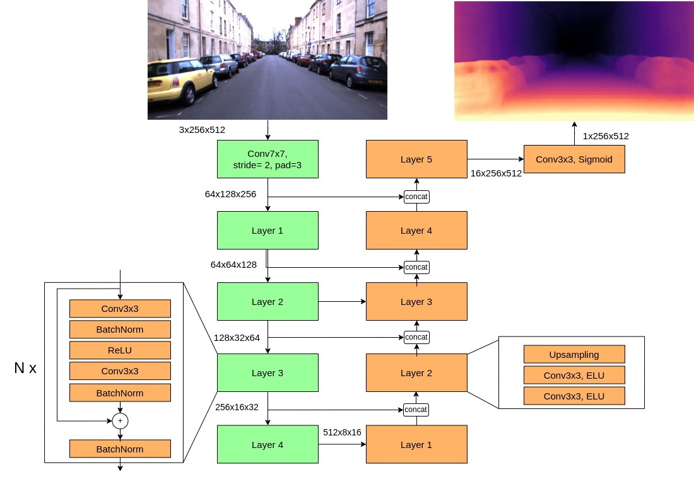
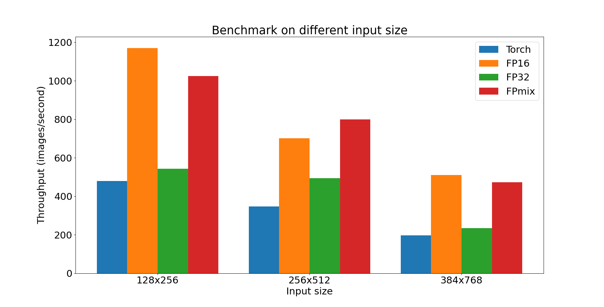
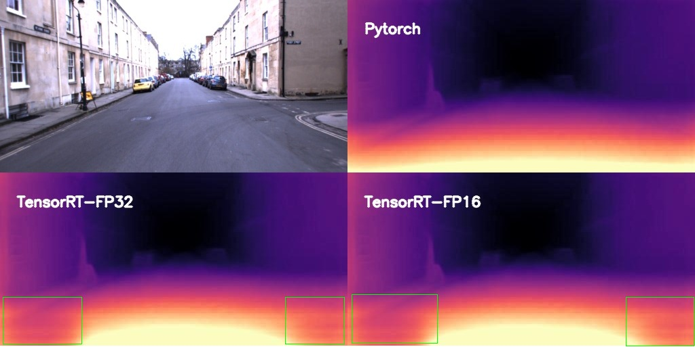
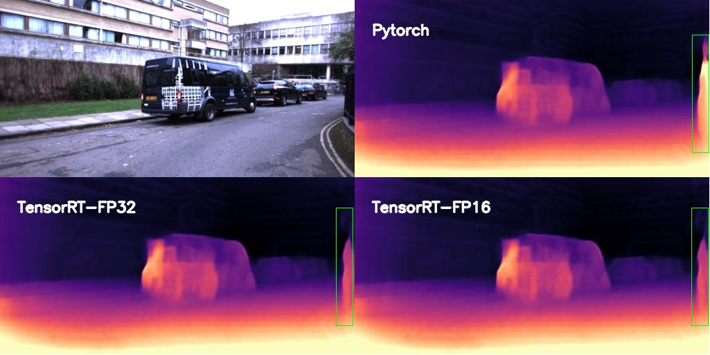

# Accelerating Monocular Depth Estimation using TensorRT

***Depth estimation*** là bài toán kinh điển trong lĩnh vực xử lý ảnh và được ứng dụng trong nhiều lĩnh vực như xe tự hành, xây dựng cấu trúc 3D, điều khiển robot. Thông tin này thường được ước lượng bằng thiết bị cảm biến như LiDAR, hoặc camera đặc biệt như Stereo camera. Với sự phát triển của Deep Learning, nhiều nhà nghiên cứu bắt đầu quan tâm đến việc ứng dụng các mạng học sâu để giải quyết bài toán này. ***Monocular Depth Estimation (MDE)*** là bài toán sử dụng mạng học sâu để ước lượng depth dựa trên 1 ảnh. <!-- more -->

Trong nghiên cứu khoa học, các tiêu chí về ứng dụng thực tế bao gồm như khả năng triển khai mô hình, tốc độ thực thi, … thường được bỏ qua. Hiện tại, nhóm nghiên cứu của chúng tôi đang giải quyết MDE cho lĩnh vực Autonomous Driving. Chúng tôi chỉ tập trung nghiên cứu các giải pháp sao cho độ sâu ước lượng khớp với đô sâu từ LiDAR nhiều nhất có thể. Tuy nhiên, Autonomous driving là những bài toán có yêu cầu nghiêm ngặt về thông lượng và độ trễ mong đợi từ các mô hình học sâu. Hôm nay, chúng tôi muốn trả lời câu hỏi: ***“Khả năng triển khai thực tế của mô hình MDE này như thế nào?”*** 

TensorRT là một một thư viện được phát triển bởi NVIDIA nhằm cải thiện tốc độ inference, giảm độ trì trệ trên các thiết bị sử dụng card đồ họa NVIDIA. Với sự hỗ trợ cho mọi framework như Pytorch, Tensorflow, TensorRT giúp xử lý lượng lớn dữ liệu với độ trễ thấp thông qua các tính năng tối ưu hóa mạnh mẽ, giảm độ chính xác và sử dụng bộ nhớ hiệu quả.

Trong bài viết này, chúng tôi sẽ tăng tốc độ thực thi mô hình MDE trên TensorRT. Cụ thể, chúng tôi so sánh nhiều tiêu chí khác nhau giữa Pytorch và TensorRT qua các tiêu chí như: Sai số so với LiDAR, tốc độ thực thi, và kết quả trực quan. Kết quả thí nghiệm cho thấy TensorRT ***tăng tốc độ xử lý 2-2.5 lần*** so với PyTorch trong khi vẫn có độ lỗi tương đương. Tuy nhiên, kết quả trực quan cho thấy độ sâu của TensorRT lại xuất hiện những vùng khác thường và cần được phân tích kỹ hơn. 

Tóm lại, trong bài viết này, chúng tôi sẽ: 

- Giới thiệu bài toán Monocular Depth Estimation.
- Các bước chuyển đổi mô hình Pytorch về TensorRT.
- Thí nghiệm chi tiết độ hiệu quá Pytorch và TensorRT trên máy chủ RTX2080TI.

## 1. Monocular Depth Estimation

### 1.1. Kiến trúc mô hình

Chúng tôi sử dụng kiến trúc mô hình Encoder - Decoder. Giống như Monodepth2, Encoder được sử dụng bài này là mô hình Resnet. Các block cơ bản của Resnet bao gồm các phép tích chập 3x3, BatchNorm, hàm kích hoạt ReLU. Tương tự, Decoder cũng bao gồm các phép tích chập, hàm kích hoạt ELU, và phép Upsampling. Với thông tin toàn cục được trích xuất từ Encoder, Decoder mã hóa và suy luận thông ra thông tin độ sâu. Đầu ra của DepthNet có giá trị trong khoảng [0, 1] (hàm Sigmoid) biến đổi và scale với hằng số để có giá trị depth. Kiến trúc chi tiết mô hình DepthNet được mô tả như hình dưới. Bộ trích xuất đặc trưng không chỉ giới hạn ở ResNet mà còn có thể là các mô hình mạnh mẽ hơn ví dụ như Transformer.



### 1.2. Tập dữ liệu

Chúng tôi sử dụng tập dữ liệu Oxford Robotcar. Đây là tập dữ liệu kinh điển cho bài toán Autonomous driving, được thu thập ở nhiều điều kiện thời tiết khác nhau, với thời gian thu thập hơn một năm tại thành phố Oxford. Dữ liệu có thông tin của nhiều sensors như LiDAR, RADAR, GPS để hỗ trợ nhiều bài toán nghiên cứu. Chúng tôi sử dụng ảnh RGB và LiDAR lần lượt làm đầu vào và ground truth đánh giá mô hình. Tập đánh giá được chúng tôi trình bày trong ảnh dưới


### 1.3. Tiêu chí đánh giá

Với độ sâu ước lượng từ mô hình $\bold{d}$ và ground truth từ LiDAR $\bold{d}^*$. Chúng tôi sử dụng tiêu chí Absolute error (Abs rel) và Root mean square error (RMSE) để đánh gía chất lượng độ sâu:

$$
abs\_rel = \frac{1}{|\bold{d}|}\sum |d^*-d|/d^* \\ rmse = \sqrt{\frac{1}{|\bold{d}} \sum||d^* - d||^2/d^*}
$$

## 2. Chuyển đổi PyTorch sang TensorRT

Có nhiều cách để chuyển đổi mô hình PyTorch sang TensorRT. Trong bài này, chúng tôi sẽ sử dụng thư viên ***torch_tensorrt***.  Torch-TensorRT là trình biên dịch Ahead-of-Time (AOT), nghĩa là trước khi triển khai mã TorchScript, mô hình sẽ trải qua một bước biên dịch chuyển đổi chương trình TorchScript tiêu chuẩn thành một mô-đun được hỗ trợ bởi TensorRT engine. Sau quá trình biên dịch, mô hình được sử dụng không khác gì một TorchScript module.

1. Khởi tạo mô hình và load pretrained weights cho mô hình:

    ```python
    import networks

    class DepthNet(nn.Module):
        def __init__(self, encoder, decoder, min_depth = 0.1, max_depth=100, med_scale = 17.769):
            super(DepthNet, self).__init__()
            self.encoder = encoder
            self.decoder = decoder
            self.min_depth = min_depth
            self.max_depth = max_depth
            self.med_scale = med_scale

        def disp_to_depth(self, disp):
            min_disp = 1 / self.max_depth
            max_disp = 1 / self.min_depth
            scaled_disp = min_disp + (max_disp - min_disp) * disp
            depth = 1 / scaled_disp
            return depth
            
        def forward(self, input_image):
            features = self.encoder(input_image)
            disp = self.decoder(features)
            depth = self.disp_to_depth(disp) * self.med_scale
            return depth

    # Create Encoder, Decoder
    encoder = networks.ResnetEncoder(opt.num_layers, False)
    decoder = networks.DepthDecoder(encoder.num_ch_enc)

    # Load weights
    encoder_path = os.path.join(opt.load_weights_folder, "encoder.pth")
    decoder_path = os.path.join(opt.load_weights_folder, "depth.pth")
    encoder.load_state_dict(torch.load(encoder_path))
    decoder.load_state_dict(torch.load(decoder_path))

    # DepthNet
    model = DepthNet(encoder, decoder)
    model.eval()
    model.cuda()
    ```

2. Chuyển mô hình nn.Module qua TensorRT
    - *<u>inputs</u>:* Trong đó, chúng tôi thiết lập TensorRT có thể nhận đầu vào có nhiều shape khác nhau bằng cách thêm 3 tham số sau cho torch_tensorrt.Input:
        * **min_shape**: Kích thước nhỏ nhất mà TensorRT sẽ tối ưu.
        * **opt_shape**: TensorRT sẽ tập trung tối ưu dựa trên kích thước này.
        * **max_shape**: Kích thước lớn nhất mà TensorRT sẽ tối ưu.
    
    Theo document, người dùng sẽ có chất lượng đầu ra tốt nhất trong khoảng shape này. 
    
    Bên cạnh đó, torch_tensorrt.Input có tham số dtype để xác định kiểu dữ liệu đầu vào.
    
    - *<u>enabled_precisions</u>*: Tham số chọn độ chính xác của mô hình mà TensoRT sẽ tối ưu. TensorRT hỗ trợ 3 loại độ chính xác là float-32, float-16, và int-8. Bên cạnh đó, người dùng có thể chọn option mixed-precision: TensorRT sẽ tự động chọn kiểu dữ liệu để tối ưu nhất. Trong bài viết này, chúng tôi sẽ thí nghiệm 3 loại độ chính xác sau:
        - Float-32: enabled_precisions = { torch.float }
        - Float-16: enabled_precisions = { torch.half }
        - Mixed-precision: enabled_precisions = { torch.float, torch.half }

    ```python
    inputs = [
    torch_tensorrt.Input(
            min_shape=[1, 3, 128, 256],
            opt_shape=[1, 3, 256, 512],
            max_shape=[8, 3, 384, 768],
            dtype=torch.float  # or torch.half
        )]
    enabled_precisions = {torch.float, torch.half}   
    trt_ts_module = torch_tensorrt.compile(
            model, inputs=inputs, enabled_precisions=enabled_precisions
        )
    # torch.jit.save(trt_ts_module, "path/to/trt_ts.ts")
    # trt_ts_module = torch.jit.load("path/to/trt_ts.ts")

    ```

Bạn đọc có thể xem source tại đây: [TickLabVN/TensorRT-MDE](https://github.com/TickLabVN/TensorRT-MDE/tree/master/Server)

## 3. Thiết lập

Toàn bộ quá trình biết đổi ở trên và quá trình benchmark được chúng tôi thực hiện trên server có cấu hình bên dưới. Chúng tôi sử dụng docker image ***nvcr.io/nvidia/pytorch:23.09-py3*** cung cấp bởi Nivida:

| torch | 2.1.0 |
| --- | --- |
| TensorRT | 8.6.1 |
| CUDA version | 12.2 |
| GPU | RTX 2080TI |
| CPU | Intel(R) Core(TM) i9-10900F CPU @ 2.80GHz |

Đoạn code chúng tôi thực hiện benchmark như sau:

```python

# Reference:https://developer.nvidia.com/blog/accelerating-inference-up-to-6x-faster-in-pytorch-with-torch-tensorrt/
import torch
import torch_tensorrt
import time
import numpy as np
import torch.backends.cudnn as cudnn

cudnn.benchmark = True

def benchmark(model, use_cuda = True, input_shape=(1, 3, 256, 512), dtype='fp32', nwarmup=50, nruns=1000):
    input_data = torch.randn(input_shape)
    if use_cuda:
        input_data = input_data.to("cuda")
    if dtype=='fp16':
        input_data = input_data.half()
        
    print("Warm up ...")
    with torch.no_grad():
        for _ in range(nwarmup):
            features = model(input_data)
    torch.cuda.synchronize()
    print("Start timing ...")
    timings = []
    with torch.no_grad():
        for i in range(1, nruns+1):
            start_time = time.time()
            pred_loc  = model(input_data)
            torch.cuda.synchronize()
            end_time = time.time()
            timings.append(end_time - start_time)
            if i%10==0:
                print('Iteration %d/%d, avg batch time %.2f ms'%(i, nruns, np.mean(timings)*1000))

    print("Input shape:", input_data.size())
    print('Average throughput: %.2f images/second'%(input_shape[0]/np.mean(timings)))

# Load model
trt_model = torch.jit.load("path/to/trt_ts.ts")
benchmark(trt_model, 
					use_cuda = True, 
					input_shape=(1, 3, 256, 512), 
					nruns=100, 
					dtype="fp16") # fp32
```

## 4. Kết quả thí nghiệm
### 4.1. Kết quả định lượng

#### 4.1.1. Đánh giá chất lượng độ sâu (m)
> batch-size = 1, resnet18

*Số liệu cho thấy việc chuyển mô hình từ Pytorch sang TensorRT có thay đổi chất lượng độ sâu nhưng không đáng kể.*

| Method | abs_rel | rmse |
| --- | --- | --- |
| Pytorch | 0.132 | 5.345 |
| TensorRT Float-16 | 0.132 | 5.317 |
| TensorRT Float-32 | 0.132 | 5.321 |
| TensorRT Mixed Precision | 0.132 | 5.317 |

#### 4.1.2. Đánh giá tốc độ thực thi với kích thước đầu vào khác nhau
> batch-size = 1, resnet18 (images / seconds)

Đồ thị cho thấy TensorRT cho tốc độ xử lý ở 3 thiết lập đều nhanh hơn so với Pytorch, trong đó độ chính xác Float-16 và mixed-precision tăng tốc độ xử lý từ 2-2.5 lần. Bên cạnh đó, thiết lập Float-16 có số liệu tốt hơn Float-32 từ 1.5 (256x512) tới 2 lần (128x256, 384x768) chứng tỏ việc tăng tốc nằm ở việc tối ưu độ chính xác còn float 16 bit.



#### 4.1.3. Đánh giá tốc độ thực thi khi xử lý theo batch
> input-shape = 256x512, resnet18 (images / seconds)*

Đồ thị cho thấy tất cả thiết lập đều cho thông lượng tăng khi tăng batch size, trong đó số liệu cải thiện vượt trội khi thay đổi batch size lên 16, và tăng nhẹ cho batchsize từ 16 trở đi. TensorRT ở độ chỉnh xác float-16 và mixed precision đều có băng thông cao gấp 2.5-3 lần so với Pytorch.


#### 4.1.4. Đánh giá tốc độ thực thi trên nhiều Encoder khác nhau
> batch-size=1, input-shape = 256x512 (images / seconds)

Tương tự như việc thay đổi kích thước đầu vào,  TensorRT cho tốc độ xử lý ở 3 thiết lập đều nhanh hơn so với Pytorch, trong đó độ chính xác Float-16 và mixed-precision tăng tốc độ xử lý từ 2-2.5 lần


### 4.2. Kết quả định tính


Kết quả trực quan cho thấy depth map dự đoạn bởi TensorRT xuất hiện những vùng bất thường. Những vùng này xuất hiện ở cả độ chính xác Float-32 và Float-16 chứng tỏ lỗi do cách kết hợp các phép tính toán của TensorRT.





## 5. Kết luận

Trong bài viết này, chúng tôi đã giới thiệu bài toán ***Monocular Depth Estimation*** ***(MDE)*** là bài toán sử dụng mạng học sâu để ước lượng depth dựa trên 1 ảnh. Một mạng học sâu kiến trúc Encoder-Decoder nhận đầu là ảnh và đầu ra là Depth map chưa được scale.

Để tăng tốc để xử lý cho mô hình, chúng tôi chuyển đổi mô hình từ dạng Pytorch sang TensorRT. Chúng tôi đã trình bày quá trình chuyển đổi này sử dụng thư viện torch_tensorrt, cũng như các tham số tối ưu. 

Chúng tôi đã trình bày kết quả so sánh sâu về băng thông xử lý giữa Pytorch và TensorRT. Kết quả cho thấy TensorRT cải thiện tốc độ từ 2-2.5 lần so với Pytorch ở thiết lập Float-16 và Mixed precision.

Trong phần tới, chúng tôi sẽ trình bày cách triển khai mô hình MDE lên Jetson Nano và tăng tốc độ xử lý bằng TensorRT.

## 6. Tham khảo

[1] [https://medium.com/@zergtant/accelerating-model-inference-with-tensorrt-tips-and-best-practices-for-pytorch-users-7cd4c30c97bc](https://medium.com/@zergtant/accelerating-model-inference-with-tensorrt-tips-and-best-practices-for-pytorch-users-7cd4c30c97bc)

[2] [https://developer.nvidia.com/blog/accelerating-inference-up-to-6x-faster-in-pytorch-with-torch-tensorrt/](https://developer.nvidia.com/blog/accelerating-inference-up-to-6x-faster-in-pytorch-with-torch-tensorrt/)

[3] [https://pytorch.org/TensorRT/](https://pytorch.org/TensorRT/)