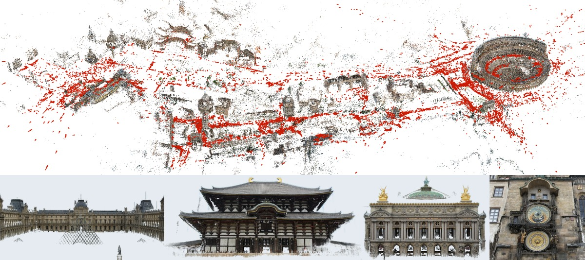
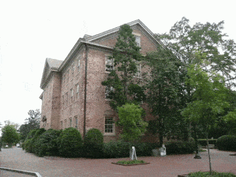
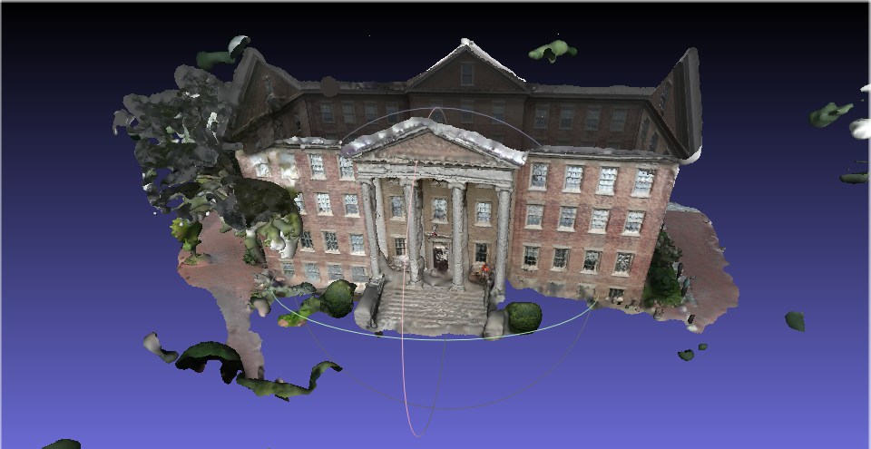
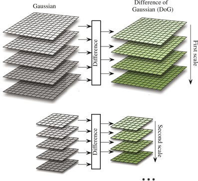
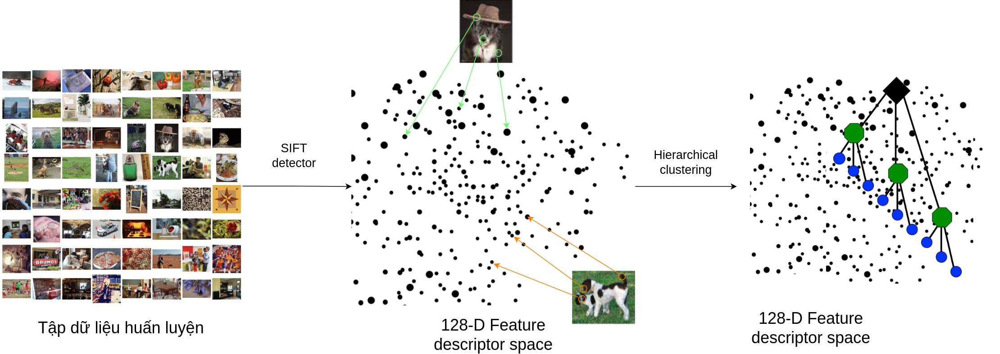
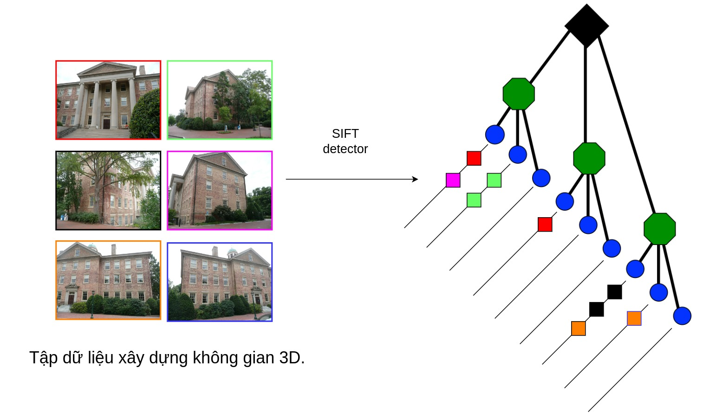
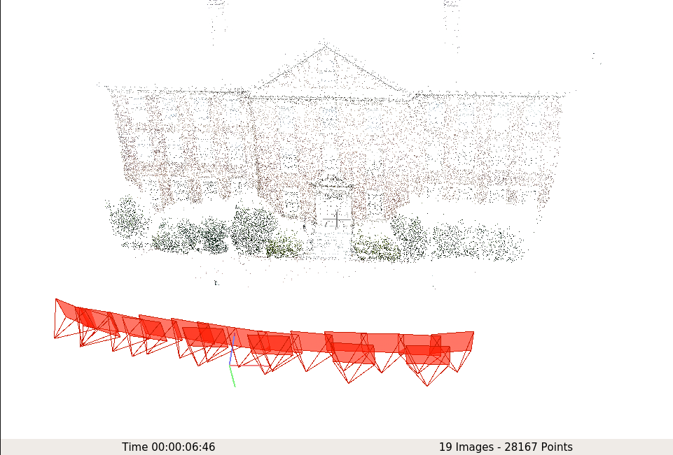
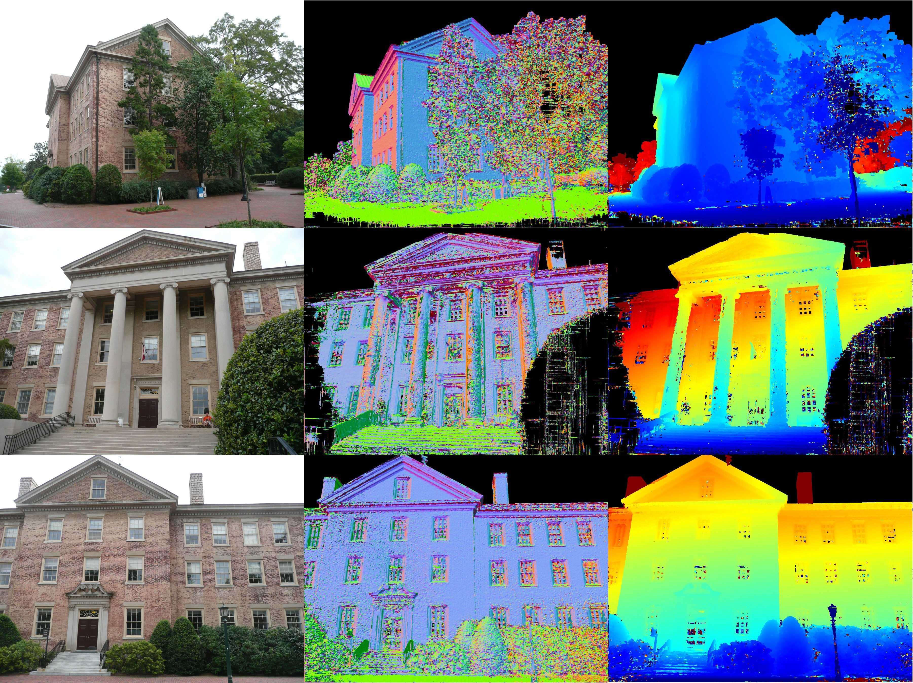
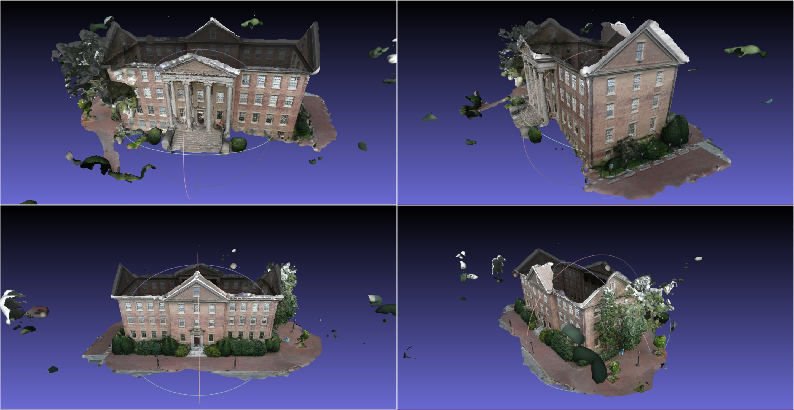

# COLMAP: A software for 3D Spare & Dense Reconstruction

<figure markdown>

{ width="600" }
</figure>

Xây dựng lại cấu trúc 3D là một trong các ứng dụng quan trọng trong Thị giác máy tính. Với đầu vào là một loại các bức ảnh chụp xung quanh một đối tượng, yêu cầu đầu ra là hình ảnh không gian 3D của vật thể. Quá trình xây dưng này yêu cầu thực hiện nhiều bước và phức tạp. Trong phần này, chúng tôi sẽ giới thiệu các bạn phần mềm COLMAP - phần mềm đa dụng giúp bạn dễ dàng xây dựng không gian 3D của đổi tượng. Qua bài viết, chúng tôi hi vọng bạn đọc có thể tìm thấy được nguồn cảm hứng mới từ các bài toán thị giác máy tính. <!-- more -->

## 1. Tập dữ liệu và các bước thực hiện

COLMAP xây dựng không gian vật thể qua các bước sau: 1) Feature Detection, COLMAP sử dụng thuật toán SIFT để trích xuất đặc trưng của ảnh. 2) Feature Matching, xét lần lượt từng ảnh, COLMAP sẽ tìm tập các ảnh có phần ảnh trùng khớp với ảnh đang xét. 3) Spare Reconstruction, sự dụng các ảnh đã biết có vùng trùng khớp nhau ở bước trước, COLMAP giải quyết bài toán Triangulation để tìm ra độ sâu ảnh, từ đó xây dựng được không gian thưa. 4) Dense Reconstruction: Xây dựng không gian 3D dày đặc từ không gian thưa.

Trong phần trình bày này, chúng tôi sử dụng dữ liệu South Building, gồm 128 bức ảnh kích thước lớn chung xung quanh tòa nhà như hình dưới. Chúng tôi sẽ sử dụng phần mềm Colmap để xây dựng lại không gian 3D dày đặc như hình bên phải:

<figure markdown>

  
  <figcaption markdown>
  Hình 1. Dữ liệu South Building để xây dựng không 3D.
  </figcaption>
</figure>
<figure markdown>

  
  <figcaption markdown>
  Hình 2: Kết quả không gian dày đặc xây dựng từ Colmap
  </figcaption>
</figure>

## 2. Feature Detection

Thuật toán trích xuất đặc trưng mặc định của COLMAP là SIFT. Do đó, chúng tôi sẽ giới thiệu thuật toán này trước khi trình bày kết quả từ COLMAP.

Scale-Invariant Feature Transform (SIFT) là thuật toán trích xuất ảnh cục bộ được đề xuất bởi nhà nghiên cứu David Lowe trong thị giác máy tính. Thuật toán hoạt động với kết quả ổn định với những scale của ảnh khác nhau, bên cạnh đó cũng có thể nói giải thuật này có tính rotation-invariant. Giải thuật được ứng dụng rộng rãi trong các bài toán Object recognition, Image stitching,.... Thuật toán này bao gồm các bước sau:

1. ***Scale-space Extrema Detection***: Ở bước này, thuật toán tìm ra vị trí những điểm mang thông tin quan trọng trong bức ảnh bằng bộ lọc Laplacian of Gaussian (LoG). Tuy nhiên những đặc trưng này có thể bị thay đổi cho những ảnh có độ co dãn khác nhau . Do đó tác giả đề xuất sử dụng cùng lúc nhiều bộ lọc có kích thước khác nhau thực hiện trên ảnh được thay đổi kích thước khác nhau. Bên cạnh đó, vì bộ lọc LoC tính toán phức tạp, tác giả đề xuất phép xấp xỉ bộ lọc này là phép Difference of Gaussian: Lấy hiệu của hai phép Gaussian độ lớn liên tiếp. Thuật toán tiếp tục thực hiện một phép phép lọc dự liệu để có kết quả cuối cùng.
    <figure markdown>

    { width="600" }
    <figcaption markdown>
    Hình 3: Hình miêu tả bước ***Scale-space Extrema Detection để tìm vị trí có thông tin quan trọng.*** Ở từng scale, SIFT sẽ xấp xỉ LoG bằng cách tình hiệu giữa kết quả các Gaussian Kernel khác nhau.
    </figcaption>
    </figure>

2. ***Keypoint Localization:*** Ở bước này, tác giả đề xuất cách tinh chỉnh vị trí các điểm quan trọng ở bước trên tốt hơn. Hơn nữa, tác giả cũng loại bỏ nhưng điểm quan trọng nào được nghi ngờ là cạnh ở bước này.
3. ***Orientation assignment:*** Bên cạnh vấn đề co dãn, đặc trưng của một điểm có thể khác nhau khi thực hiện phép xoay. Để tránh tình trạng này, tác giả đề xuất tính hướng xoay của đặc trưng. Nhờ đó, hai đặc trưng sẽ được xoay cùng về 1 góc trước khi được so sánh. Tác giả lấy hướng chiếm đa số của tất cả pixel trong ô vuông 16x16 xung quanh điểm đặc trưng.

    <figure markdown>

    { width="600" }
    <figcaption markdown>
    Hình 4: Hình miêu tả bước Orientation assignment. Với mỗi điểm keypoint, SIFT sẽ tính gradient của vùng 16x16 xung quanh (Trong hình chỉ minh hoạt 8 ô) để xây dựng biểu đồ histogram biểu diễn hướng ở bên phải. Hướng chiếm đa số (cột cao nhất) chính là hướng đại diện cho keypoint.
    </figcaption>
    </figure>

4. ***Keypoint Descriptor:*** SIFT mô tả đặc trưng của điểm quan trọng bằng vector 128 chiều. Xét vùng 16x16 xung quanh điểm này, SIFT chia vùng này thành 4 ô vuông 4x4 liền kề không trung nhau. Mỗi ô vuông, SIFT tình đồ thì histogram theo hướng chia làm 8 chiều, mỗi chiều biểu diễn góc 45 độ. Histogram của 4 vùng này hợp lại thành vector $4 \times 4 \times 8  = 128$ chiều.

    <figure markdown>

    { width="600" }
    <figcaption markdown>
    Hình 5: Hình minh hoạt cách trích xuất Keypoint Descriptor của SIFT.
    </figcaption>
    </figure>

    <figure markdown>

    { width="600" }
    <figcaption markdown>
    Hình 6: Kết quả Feature Detection sử dụng SIFT từ COLMAP. Những điểm màu đỏ là những điểm keypoints.
    </figcaption>
    </figure>

## 3. Feature Matching

Ở bước này, COLMAP sẽ sử dụng đặc trưng trích xuất được từ bước Feature Detection để tìm ra các tấm ảnh có vùng trùng nhau. Colmap cung cấp nhiều thuật toán matching khác nhau bao gồm:

- Exhaustive matching: Thuật toán phù hợp với dữ liệu ít. Mỗi tấm ảnh sẽ được thực hiện với TẤT CẢ tấm ảnh trong kho dữ liệu. Thuật toán này cho độ chính xác cao, nhưng lại có chi phí tính toán lớn.
- Sequential Matching: Phù hợp khi dữ liệu biết trước là có thứ tự.
- Vocabulary Tree Matching: Thuật toán phổ biến nhất, có tốc độ thực thi nhanh với tập dữ liệu lớn.
- Spatial Matching: Phù hợp khi mỗi sample có thông tin tọa độ. Colmap sẽ lấy những ảnh có thông tin này gần nhau để matching.
- Transitive Matching: Thuật toán này phù hợp khi dữ liệu đã có thông tin một vài ảnh đã được match với nhau.
- Custom Matching

Trong phần này, chúng tôi sẽ sử dụng thuật toán Vocabulary Tree Matching. Chúng tôi đầu tiên sẽ trình bày nhanh cách tạo Vocabulary Tree, và dùng cây này để giải quyết bài toán Image Retrieval. Sau đó, chúng tôi sẽ trình bày kết quả từ Colmap.

### Vocabulary Tree

Vocabulary Tree được xây dựng bằng cách phân cựm từng tầng không gian đặc trưng từ tập dữ liệu ảnh huấn luyện. Cụ thể, Vocabulary Tree được xây dựng từng bước như sau: 

1. Cho tập dữ liệu ảnh huấn luyện ,tập dữ liệu có thể là tập ảnh dùng để xây dựng lại cảnh hiện tại, hoặc tập dữ liệu khác (vd ImageNet). Toàn bộ bức ảnh này sẽ biến đổi vào không gian đặc trưng bằng thuật toán, vd SIFT detection.
2. Với không gian đặc trưng được trích xuất, thuật toán gom cụm phân tầng được sử dụng và nhóm các đặc trưng giống nhau lại thành cụm. Đây chính là Vocabulary Tree

<figure markdown>

{ width="700" }
<figcaption markdown>
Hình 7: Hình miêu tả cách xây dựng Vocabulary Tree
</figcaption>
</figure>

Sau khi đã xây dựng Vocabulary Tree, Colmap thực hiện tìm cặp ảnh tương đồng như sau:

1. Trích xuất đặc trưng các ảnh dùng để xây dựng, sử dụng vocabulary tree để tìm node lá tương ứng cho đặc trưng. Mỗi node lá sẽ lưu lại các thông tin: Có bao nhiêu ảnh có đặc trưng thuộc lá này? Ảnh này có bao nhiêu đặc trưng thuộc là này? Các thông tin này được sử dụng để tính khoảng cách với ảnh truy vấn.

    <figure markdown>

    { width="600" }
    <figcaption markdown>
    Hình 8: Hình miêu tả các phân bố đặc trưng của dữ liệu vào các node lá trong Vocabulary Tree. 
    </figcaption>
    </figure>

2. Xét 1 ảnh bất kỳ (ảnh truy vấn), Colmap trích xuất và tìm node lá tương ứng cho từng đặc trưng. Các ảnh có số lượng đặc trưng cùng cụm với đặc trưng của ảnh truy vấn càng nhiều thì càng giống ảnh truy vấn (Thực tế, Colmap sử dụng phép tính điểm từ thuật toán đề xuất). Thuật toán sẽ chọn ra tọp K ảnh có điểm cao nhất với ảnh truy vấn nhất trong kho dữ liệu.

    <figure markdown>

    { width="600" }
    <figcaption markdown>
    Hình 9: Hình miêu tả cách tìm các hình trung khớp với ảnh truy vấn sử dụng Vocabulary Tree.
    </figcaption>
    </figure>

Sau khi đã tìm ảnh cặp, Colmap sẽ thực hiện phép Feature Matching: Tìm các điểm keypoint tương đồng giữa hai ảnh. Để hạn chế nhiễu, thuật toán thực hiện thêm bước Image Verification: Loại bỏ outlier bằng thuật toán RANSAC.

<figure markdown>

{ width="700" }
<figcaption markdown>
Hình 10: Kết quả tìm kiếm hình ảnh tương ứng với ảnh truy vấn và phép gán các keypoint tương đồng với nhau.
</figcaption>
</figure>

## 4. Spare reconstruction

Sau khi đã tìm được các cặp ảnh cũng như các keypoint tương ứng của hai ảnh khớp nhau, COLMAP sẽ xây dựng lại không gian 3D thưa bằng cách chiếu các điểm keypoint này lên không gian. Xây dựng không gian thưa thuộc về bài toán Structure From Motion (SFM): Colmap thực hiện từng bước để giải quyết bài toán này như sau:

***Step 1 - Initialization***

Colmap chọn ra hai ảnh ngẫu nhiên (chúng tôi nghĩ là cặp ảnh có số lượng keypoint matching lớn nhất). Với keypoint matching của hai ảnh đã được tính, Colmap sẽ giải quyết các bài toán:

1. Tìm vị trí tương đối giữa hai camera: bằng cách giải bài toán 1) Tìm Fundamental matrix, 2) tìm Essential matrix từ Fundamental matrix, 3) Tìm camera pose từ Essential matrix, bước này ra 4 kết quả, và 4) chọn ra kết quả thõa điều kiện Cheirality. Các phương pháp lọc nhiễu như RANSAC được áp dụng ở bước 1, 2, 3.
2. Chiếu các điểm này lên không gian 3D, bước này có thể đã được thực hiện ở bước 1.4

***Step 2: Image Registration:***

Sau khi đã xây dựng không gian thưa từ hai ảnh, Colmap sẽ thêm ảnh để tiếp tục xây dựng không gian thưa. Ảnh được chọn phải có các điểm keypoint matching với các điểm keypoint có sẵn từ các hình được xây dựng. Ở bước này, Colmap giải quyết các bài toán:

- Xác định điểm keypoint của ảnh được thêm vào matching với các điểm keypoint và điểm đã được xây dựng lên không gian 3D nào trong các ảnh đã được xây dựng.
- Perspective-n-Point problem: Tìm vị trí tương tương đối giữa camera được thêm vào so với các camera.

***Step 3: Triangulation***

Colmap sẽ chiếu các điểm keypoint của ảnh được thêm chưa được xây dựng vào không gian 3D.  

***Step 4: Bundle Adjustment***

Ở bước 2, vị trí camera được tối ưu từ các điểm point cloud đã có sẵn. Ở bước này, Colmap sẽ thay đổi đồng thời vị trí camera và point cloud để có đươc kết quả tối ưu nhất.

***Step 5: Outlier filtering***

Sau khi đã tối ưu các điểm point cloud và vị trí camera, Colmap sẽ loại bỏ những điểm point cloud nào cho error lớn khi chiếu trên mặt phẳng ảnh 2D.

Colmap tiếp tục trở lại bước hai cho đến khi tất cả các ảnh đã được thêm vào.

Colmap thực hiện thuật toán Incremental Structure from Motion. Ngoài ra còn một vài thuật toán khác như Global, Hierachical SFM.

### Kết quả từ Colmap:

<figure markdown>

{ width="700" }
<figcaption markdown>
Hình 11: Kết quả Spare reconstruction xây dựng từ 19 góc nhìn.
</figcaption>
</figure>

<figure markdown>

{ width="700" }
<figcaption markdown>
Hình 12: Kết quả Spare reconstruction xây dựng từ 57 góc nhìn.
</figcaption>
</figure>

<figure markdown>

{ width="700" }
<figcaption markdown>
Hình 13: Kết quả Spare reconstruction xây dựng từ 128 góc nhìn.
</figcaption>
</figure>

## 5. Dense Reconstruction

Ở bước trước, Colmap đã tính được vị trí tương đối giữa các camera, và xây dựng được không gian thưa. Ở bước này, Colmap sẽ xây dựng không gian dày đặc lấp đầy những khoảng không của không gian spare. Giai đoạn này được tắt trong bước sau:

1. Ước lượng độ sâu và normal map cho từng ảnh. Giá trị này phải như nhau ở các pixel tương trong các view khác nhau. So với bước spare reconstruction, các điểm point cloud chỉ được xây dựng từ toàn bộ các pixel thay vì chỉ các điểm keypoint do đó Colmap có thể xây dựng được không gian thưa dày đặc hơn.
2. Lấy đừng khoảng trốn giữa các điểm point cloud sử dụng thuật toán Poisson Surface Reconstruction.

<figure markdown>

{ width="700" }
<figcaption markdown>
Hình 14: Kết quả ước lượng normal map (cột giữa) và độ sâu (cột bên phải) từ bước 1.
</figcaption>
</figure>

<figure markdown>

{ width="700" }
<figcaption markdown>
Hình 15: Kết quả xây dựng Dense Reconstruction.
</figcaption>
</figure>

## 6. Kết luận

Trong bài viết này, chúng tôi đã trình bày các bước thực hiện phần mềm COLMAP từ tập các ảnh đầu vào đến không gian 3D dày đặc. Ở mỗi bước, chúng tôi tóm tắt thuật toán COLMAP sử dụng bao gồm SIFT (Feature Detection), Vocabulary Tree (Feature Matching), Structure From Motion. Kết quả từ không gian dày đặc cho thấy COLMAP xây dựng lại không gian 3D rất tốt chỉ với 128 ảnh dữ liệu. Bạn đọc quan tâm tới COLMAP có thể tìm thấy những kết quả khác tại trang chủ phần mềm.

## 7. Tham khảo

- *Large-scale 3D modeling*. CVPR 2017 Tutorial - Large-­scale 3D Modeling from Crowdsourced Data. (n.d.) - [https://demuc.de/tutorials/cvpr2017/](https://demuc.de/tutorials/cvpr2017/)
- *Vocabulary Tree -* [https://www.micc.unifi.it/delbimbo/wp-content/uploads/2013/12/A62_Vocabulary_tree.pdf](https://www.micc.unifi.it/delbimbo/wp-content/uploads/2013/12/A62_Vocabulary_tree.pdf)
- Chahat Deep Singh. “Structure from Motion”, CMSC 426 Computer Vision