# [RL series - Part 1] Reinforcement Learning - or The Art of Decision Making in an Uncertain World

<figure markdown>

{ width="300"}

</figure>

 <!-- more -->

## Part 1: Theory

### 1. Introduction

#### 1.1 Inspiration

Let’s start with a fascinating question: How do we learn? From the first breadth you tooth until this very moment when you’re sitting here reading this article is a never-ending process of learning. So how exactly do you do this? How do you know that in front of you is a “dog” and not a “cat” or a “dinosaur”? Or how do you know that in order to walk properly, you have to first shift your weight onto one foot, lift the other foot, move it forward, place it onto the ground, and then repeat with the others? The answer is through multiple trial-and-errors and feedbacks of others and of the environment. Remember the moment you mistakenly called a dog a cat? If you were with your parents, they would kindly correct you, pointing out that it's actually a dog. However, if it happened in front of your friends, they might laugh hard at you, leaving you puzzled. These reactions serve as valuable feedback, helping you learn the difference between a dog and a cat for next time (unless you want to risk another round of laughter!). The same goes with learning how to walk, you may have experimented with tilting your body in the wrong direction or not alternating your feet properly to end up finding out that these approaches were not really successful, so you stopped doing that and tried some other techniques to the point when you fell comfortable. Reinforcement Learning algorithms try to do just that: an agent explores different actions, evaluates their outcomes, and adjusts its strategies to maximize rewards and minimize penalties in future interactions. Besides Deep Learning, which seeks to mimic the intricacies of human brain functions such as neural transmission and pattern recognition, Reinforcement Learning is a stepping stone in the effort of imitating human in terms of learning and making decisions.

#### 1.2 What is Reinforcement Learning?

It’s a type of Machine Learning, where an agent learn to make decision so as to maximize the accumulative reward. To do this, the agent has to interact with the environment, and adjust its actions base on feedbacks in terms of rewards and penalties.

#### 1.3 Why do we need Reinforcement Learning?

There appears to be a category of problems where the labels for our data is not available. Although most of the time we can do the labeling on our own, or with the help of an expert (e.g: segmenting the “tumor” region and “non-tumor” region in a medical image, or classifying images with respect to different people in a face-recognition task,…), but sometimes there are problems where the correct labeling is simply unattainable. Haven’t heard of those kinds of problem before?

1. Imagine your task is to find the fastest way out of a maze, from the starting state, should you take the left move, which will take you closer to the exit, or the right move, which will take you further away, in either move, you’ll face a possibility of being stuck in a death end.
2. Imagine that your task is to maximize your happiness. You have an exam tomorrow. Should you start studying now or watch another episode of “The Boys”?

In either circumstances, the goal you’re trying to reach is not the short-term reward (moving closer to the exit, or a little extra satisfaction from watching another episode of your favorite series), but rather a long-term reward (actually find an exit, or maximize your happiness in the long run). Remember that these 2 are not the same, and sometimes, if not most of the time, you have to sacrifice one to achieve another (choosing a longer path with the goal of actually reaching the exit, not just moving closer to it, or sacrifice your instant gratification for a more sustainable fulfillment of academic success). This highlights the first property of Reinforcement Learning, which is **_delayed reward_** (the “best” action is defined to be the action that produce the biggest long-term reward, meaning the reward accumulated through time, not the reward received immediately). But the story doesn’t end here, how do we know, from our first examples, that the longer but not shorter path with eventually leads you to the exit, or you’ll actually earn a good grade after a whole night studying for the exam. The answer is, you have to discover it yourself! Maybe you’ll find out that going right is, indeed, the action that take you to the death end, or maybe you’ll end up flunking the exam even though you’ve been cramming for it the whole night before, and realize that binge watching your favorite TV series would be, sadly, be a better choice. Interesting? We face those decisions our whole life, the only thing we could do is try one, observe the result, and change our worldview and action according to that experience in case we’ll be in that same circumstance in the future. This pinpoint the second property of Reinforcement Learning, which is **_trial and error_** (discover the “label” on our own to maximize the objective function, which is the accumulative reward).

#### 1.4 “… And I — I took the road less taken by…”

Are those examples enough whet your appetite? This article includes all the key points we’ve gathered after reading Part I of [this book](http://incompleteideas.net/book/the-book-2nd.html){:target="\_blank"}, plus our own intuition and understanding about different concepts presented. We hope that this will pave a smoother path for you on your journey into the realm of Reinforcement Learning.

### 2. Key Elements of Reinforcement Learning

We’ll start off learning some fundamental concepts that’ll be crucial for you to take a grasp of what the people in this area is talking about.

#### 1. Episodic task and Continuing task

Episodic task is a task where the agent-environment interaction breaks naturally into subsequences. In episodic tasks, there are starting states ($S_0$), and terminal states ($S_T$- where $T$ is the terminal timestep), between which is a sequence of state-action transitions. Each sequence of timesteps from a particular starting state to a particular terminal state is called an episode. It’s pretty much like video games, where the starting state is the initial position of your character, with zero point, and the terminal state is when you lose, which also denote the end of an episode, in which case you have to start the game again with the same position and zero point. In an episodic task, the succeeding states must not, by any mean, be affected by the preceding states.

Continuing task is a task where $T \rightarrow \infty$. It’s a task that lasts for the agent’s lifetime (you can see the definition of “agent” below).

#### 2. Policy ($\pi$)

A policy is a mapping from situations (or states, which is more widely use in Reinforcement Learning literatures) to actions. A policy can either be deterministic, meaning that it only return one action for each state, or stochastic, meaning that it will return an action sampled from a probability distribution for each state.

#### 3. Reward ($R$)

The reward denotes whether a state, or an action in a particular state, is good or bad.

#### 4. Return ($G$)

It’s the accumulated reward that you’ve collected along the way from the starting state to the terminal state (in episodic tasks) or for the agent’s lifetime (in continuing tasks).

So how do we formulate this $G_t$ for a specific timestep? Our first idea would be to sum all the rewards:

$$
G_t = R_{t+1} + R_{t+2} + R_{t+3} + ··· + R_T
$$

This works just fine in simple cases where $T$ is small, but if $T$ is large or approach $\infty$, this definition of return would be problematic, since $G_t$ will either be really big or approaches infinity. To deal with this, we use a discounting factor ($0 \leq \lambda \leq 1$) and reformulate $G_t$ as:

$$
G_t = R_{t+1} + \gamma R_{t+2} + \gamma^2 R_{t+3} + ... = \sum_{k=0}^\infty \gamma^k R_{t+k+1}
$$

Phewww! Now $G_t$ can converged no matter how large $T$ is. Having reach to this point, I think we should have a deeper discussion about the discount factor $\lambda$. This variable denotes how much you want to emphasize the importance of future reward. The implementation of $\lambda$ into this formula gives a beautiful effect in which rewards from states encountered are gradually fading away, and this fading manifest more clearly in states that are more further away in the future. In extreme case where $\lambda = 0$, we only care about immediate reward ($G_t = R_t$); and where $\lambda = 1$, we consider rewards received in every state the same degree of importance.

Formulate $G_t$ this way also allows us to rewrite the formula in a recursive way:

$$
G_t = R_{t+1} + \gamma G_{t+1}
$$

#### 5. Value function

Remember when we say that the goal of Reinforcement Learning is to maximize the long-term reward? But what is the long-term reward anyway? We use the term “value function” to denote this. “Wait a minute”, you may say, “How about the Return? Isn’t that definition of Return perfectly fit our definition of long-term reward?” Yeah you’re right, in a sense. Let’s make this clear.

The “value function” is the mapping from a state to its value. The “value” is defined as the _expected_ return, which has something to do with the stochastic of the environment dynamics and the actions being taken. Continue with our previous example, what do you think the long-term reward of studying for the exam be? The answer is, it _depends_. Suppose that you decide to study for the exam, this can cause different scenarios to happen, you could finish studying in a short amount of time and go to bed early, or you could end up being distracted and have to stay up late. Suppose you end up in the second scenario, the next morning, you have to choose either to wake up for exam, or sleep in for an extra 10 minutes, which in turn, can lead you to a situation of you being late for the exam… You see, the future is full of uncertainties, so the long-term reward should be computed carefully, after considering _all possibilities_ of what can happen and what action you can take, not just _one sample_ of those. Hence for the evaluation of long-term reward, we should aim at the _expected return_ instead of the _return_ itself.

#### 6. Agent

The agent is our decision maker, it interacts with the environment to receive reward, calculate the value of that state, change the value function, and change the policy if necessary and make decision according to that policy.

#### 7. Environment and Model

The environment gives the agent the reward signals. A model is the simulation of the environment, meaning that it’s built based on our data distribution collected from the environment, and is used to inferred about how the environment may behave. A model allows the agent to learn without interacting with the environment, which might be costly. Much like training to fly a helicopter in MSFS without breaking the bank!

#### 8. Markov Decision Process

<figure markdown>

{ width="700" }

  <figcaption markdown>
  Figure 1: The interaction between agent and environment in a MDP
  </figcaption>
</figure>

A Markov Decision Process (MDP) is a model that describe the interaction between the agent and the environment, throughout the sequence of decision-makings. In a MDP, at timestep $t$, the agent is in state $S_t$ and receive a reward $R_t$, the agent takes an action $A_t$, to which the environment returns with the next state $S_{t+1}$ and the reward from that next state $R_{t+1}$.

The most important property of a MDP is that the next state and reward only depend on the current state and action, not the history of states and actions. Given the previous state and action, the probability distribution of two random variable $R_t$ and $S_t$ is denoted by $p$:

$$
p(s', r|s,a) \doteq Pr\{S_t = s', R_t = r | S_{t-1} = s, A_{t-1} = a\}
$$

$p$ is often called the dynamic of the environment. Notice that the sum of probabilities of a particular pair of next state - reward over all next states and rewards possible from a particular action in a given current state, is $1$:

$$
\sum_{s' \in S}\sum_{r \in R} p(s',r|s,a) = 1, \forall s \in S, a \in A(s)
$$

At this point you may ask, why we have to take the sum over all $r$? Doesn’t it mean that the reward can varies even in the same state? The answer is yes, every state may has its own probability distribution of reward, although this isn’t the case most of the time.

#### 9. The Bellman equation

First of all we rewrite our previous definition of the state value function in form of a mathematical formula:

$$
v_\pi(s) = E[G_t | S_t = s], \forall s \in S \qquad\qquad (1)
$$

I’m supposed to give you the Bellman equation for the state value now. But in an attempt of a clear explanation, I found it easier to introduce you to the Bellman equation for the action value function first. Similar to the definition of the value of a state, the value of a state-action pair $(s,a)$ is the expected return the agent will get when it’s in state $s$ and take action $a$:

$$
q_\pi(s,a) = E[G_t|S_t = s, A_t = a]
$$

With some substitution and transformation, we can rewrite the equation as:

$$
\begin{align*} q_\pi(s,a) & = E [\textcolor{red} {R_{t+1} + \gamma G_{t+1}} | S_t = s, A_t = a] \\
& = \sum_{s' \in S}\sum_{r \in R}p(s',r|s,a)\left(r + \gamma \mathbb E[G_{t+1}|S_{t+1}=s']\right) \\
& =\sum_{s' \in S}\sum_{r \in R}p(s',r|s,a)\left(r + \gamma \textcolor{orange}{v_\pi(s')}\right)\qquad\qquad(2) \\
\end{align*}
$$

The first line is obtained by substituting $G_t$ with its recursive form - $R_{t+1} + \gamma G_{t+1}$. Now to find the expectation of the red term, you have to consider all possibilities of the next state and next reward, given the current state and action. To do this, we take the probability of reaching the next state $s’$ and receive the reward $r$, multiply with its corresponding value of the red term, then sum over all possibilities of next states and rewards from our current state-action pair. You should notice that even after the next state is given, the return of the next state $G_{t+1}$ isn’t deterministic yet, because it still depends on the next action taken the the environment dynamic, hence we still have to take the expectation of that random variable. Now according to $(1)$, we substitute the expectation in the second line with the value of the next state to reach the third line.

Now that we know that the formula for $q_\pi(s,a)$ can be derived as $(2)$. How about rewriting the value function to obtain the same structure. The value of a state is simply the same as the value of a state-action pair, but the action here is not determined yet. Hence the value of a state equals to the value of a state-action pair, weighted by the probability of taking that action according to the policy, and then sum over all possible actions:

$$
\begin{align*} v_\pi(s) & = \sum_{a \in A}\pi(a|s) q_\pi(s,a) \qquad\qquad (3)\\
& = \sum_{a \in A}\pi(a|s)\sum_{s' \in S}\sum_{r \in R}p(s',r|s,a)[r + \gamma v_\pi(s')], \quad \forall s \in S	\end{align*}
$$

Wow! We obtain the formula for $v_\pi(s)$ in such a beautiful recursive form. This is the **_Bellman Equation of the state value function_**.

So what about the **_Bellman equation of the action value function_**? Let’s return back to our equation $(2)$, this isn’t in recursive form yet. But we just have to do one more step: plug the formula at $(3)$ into the orange term in $(2)$, and…voila!

$$
\begin{align*}
q_{\pi}(s,a) & =\sum_{s' \in S}\sum_{r \in R}p(s',r|s,a)\left(r + \gamma \textcolor{orange}{\sum_{a \in A}\pi(a'|s') q_\pi(s',a')}\right)\\
\end{align*}
$$

#### 10. Optimal policy and optimal value function

The optimal policy is the policy that for every state, the value of that state is higher than those yielded by other policy:

$$
v_*(s) = \max_\pi v_\pi(s) ,\quad \forall s \in S
$$

The optimal value function is the value function under the optimal policy, which is $v_*(s)$. Intuitively, we know the value of a state under the optimal policy must equal the expected return for the best action taken from that state, hence we can write the Bellman Equation for the optimal state value function as following:

$$
\begin{align*}	v_*(s) & = \max_{a \in A} q_{\pi_*}(s,a) \\	& = \max_a \mathbb E_{\pi_*}[R_{t+1} + \gamma G_{t+1}|S_t = s, A_t = a] \\	& = \max_a\sum_{s',r}p(s',r|s,a)(r + \gamma E_{\pi_*}[G_{t+1}| S_{t+1} = s']) \\	& = \max_a\sum_{s',r}p(s',r|s,a)(r + \gamma v_*(s')) \\	\end{align*}
$$

The deriving steps are just the same as those from the formulation of the Bellman Equation for state value function above.

### 3. Dynamic Programming

Dynamic Programming (DP) is not a particular algorithm, but a collection of algorithms that computes the optimal policy after being given a perfect model of the environment as a Markov Decision Process (meaning that $p(s’,r | s,a)$, or the environment dynamic, is known for all tuples $(s,a,s’,r)$). One example of such environment is the simulation environment where the agent is a robot navigating in a grid world. In such environment, the dynamic is completely known in the sense that if you control the robot to go to the left, it will not slip to the opposite direction. It’s useful to understand that such environment can still be a stochastic environment, such as a similar environment to the above but this time, when you control the robot to go to the left, there’s 70% of its going to the left and the remaining 30% to the other direction. The universal idea of DP algorithms is that they are obtained by turning Bellman equation into assignments, that is into update rules to improve the approximation of the value functions.

#### 3.1 Policy Evaluation

Policy Evaluation is the process of computing the value function $v_\pi(s),s \in \mathcal S$ for an arbitrary policy $\pi$.

To achieve the value function, our first approach is to write the Bellman equation for every state $s \in \mathcal S$ ($\mathcal S$ is the state space, by the way). By doing this obtain a system of $|\mathcal S|$ linear equations in $|\mathcal S|$ unknowns, each unknown is the value of a state - $v_\pi(s), s \in \mathcal S$. However, solving for $v_\pi(s)$ for each $s \in \mathcal S$ is a difficult task (even impossible if $\mathcal S$ is large).

The second approach is not to obtain the true value function right away, but to update the value function iteratively:

$$
v_{k+1}(s) = \sum_{a \in A}\pi(a|s)\sum_{s',r}p(s',r|s,a)\left[r + \gamma v_k(s')\right]
$$

The value of state $s$ at $(k+1)^{th}$ iteration is estimated by the values of its succeeding states at $k^{th}$ iteration. Each iteration includes an update of every state in the state space. And when $k \rightarrow \infty$, the approximated value of each state approaches that state’s true value. Here is an algorithm for this approach:

<figure markdown>

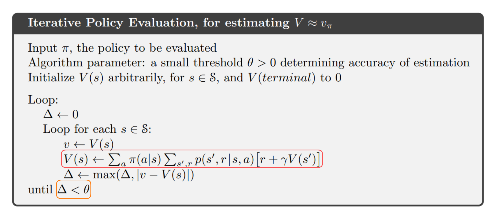{ width="700" }

</figure>

The assignment made in the red box is exactly the same as our above update formula. The inequality in the orange box is the stopping condition, which is when the absolute error of the old and new value of a state, maximum over all states, is below a specific threshold. Notice that the value of each state in this algorithm is updated “inline”, which means for each sweep through the state space, we use the immediately new value of preceding states as the update value of the succeeding states. This method brings about faster learning, and less memory requirement to store the old state values.

#### 3.2 Policy Improvement

We are able to approach the true value function for an arbitrary policy, but our goal doesn’t just end there. We need to find a better policy based on the values computed. The way we’re going to achieve this is pretty straightforward - for each state, we change the current action to the action that produces the best action value:

$$
\begin{align*} \pi'(s) & = \arg \max_a q_\pi(s,a) \\ & = \arg \max_a \sum_{s',r}p(s',r|s,a)[r + \gamma v_\pi(s')] \qquad (4) \end{align*}
$$

According to $(4)$, we have the value function of the new policy $\pi’$ as follow:

$$
v_{\pi'}(s) = \max_a \sum_{s',r}p(s',r|s,a)[r + \gamma v_\pi(s')] \qquad (5)
$$

If the new policy happens to be as good as, but no better than the old policy ($v_{\pi'}(s) = v_\pi(s)$), then $(5)$ will turn into the Bellman optimality equation:

$$
v_{\pi'}(s) = \max_a \sum_{s',r}p(s',r|s,a)[r + \gamma v_{\pi'}(s')]
$$

The fact that this is the Bellman optimality equation means that our strategy for improving the policy actually works. Policy improvement _always_ gives us a strictly better policy than the one before, except when our original policy is already optimal. In this case $\pi’(s)$ and $\pi(s)$ are both optimal policies.

#### 3.3 Policy Iteration

Policy Iteration is the combination of Policy Evaluation and Policy Improvement, in which we calculate the value function given the current policy, and then change our policy greedily with respect to the calculated value function, repeatedly until our policy and value function is (approximately) stable.

One can also imagine the Policy Iteration process as an effort to simultaneously satisfy two goals: obtaining a value function consistent with a given policy and obtaining a better (more greedy) policy. To try to reach one goal means to diverge from the other (by approaching the true value function of a policy, we find that our policy is not as greedy as we think, and by changing our policy to a better one, the value function calculated doesn’t remain true anymore). But by continuously repeating these steps, we will eventually converge to the point of the optimal policy and optimal value function.

<figure markdown>

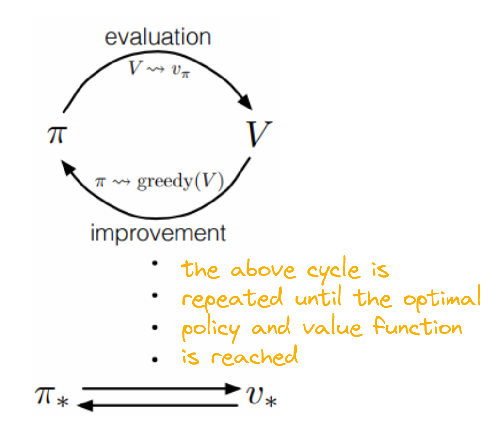{ width="500"" }

  <figcaption markdown>
  Figure 2: Diagram of Policy Iteration
  </figcaption>
</figure>

#### 3.4 Value Iteration

One question arises: If Policy Evaluation is done iteratively, then convergence exactly to $v_\pi$ occurs only in the limit (we can never find the _true_ value function by iterative method). Must we wait for the exact convergence, or can we stop short of that?

The Value Iteration algorithm stems from the idea that we should truncate the Policy Evaluation process, which will speed up the learning process, but still guarantees the convergence to the optimal value function:

<figure markdown>

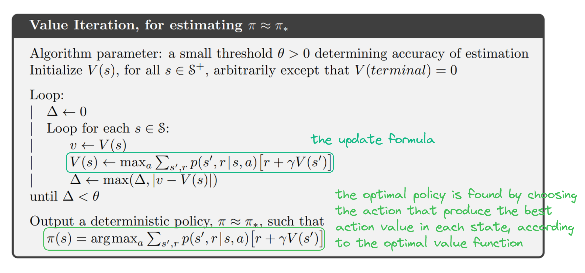{ width="700"" }

</figure>

Notice that the formula for updating $v_\pi(s)$ is now a combination of Policy Improvement (it is now computed as a maximized value, not an expected value) and truncated Policy Evaluation ($v_\pi(s)$ for every state is now calculated once for every “updated” policy, not repeatedly). One can also think of this updating formula as an application of the Bellman optimality equation. By updating $v_\pi(s)$ this way, we expect that $v_\pi(s)$ will eventually approach $v_*(s)$, and the optimal policy is obtained simply by choosing the best action in each state according to the optimal value function.

### 4. Monte Carlo Methods

_“if you’re going to try, go all the
way.
otherwise, don’t even start…”_

_— “Roll the dice” - Charles Bukowski_

Dynamic Programming algorithms requires the environment dynamic is completely no, which obviously not be the case for a lot of problems. Imagine the game of Tic-tac-toe, you may know all possible next state given the current state causes by all possible moves that your opponent can make. But the probabilities of reaching those next states is unknown, because you don’t know which strategy your opponent is using, it’s even more difficult to predict if your opponent is an irrational one. This example can be extended to almost all multi-player games, such as poker, blackjack, chess, go,… In these cases the expected return (true value) of a state can only be calculated by reaching the end of the game multiple times to calculate actual returns and averaging those returns. This is the idea of Monte Carlo methods.

#### 4.1 Monte Carlo Prediction (or Monte Carlo Estimation of State Value)

The algorithm for Monte Carlo (MC) Prediction is presented below:

<figure markdown>

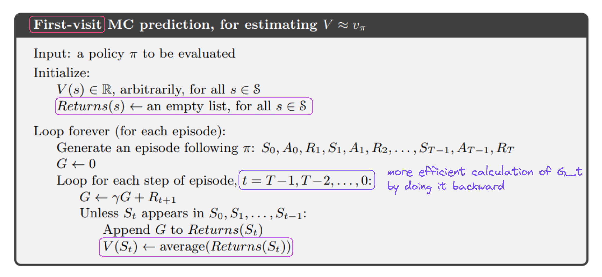{ width="700"" }

</figure>

This is the “First-visit” MC prediction, meaning that we estimate $v_\pi(s)$ by averaging out returns followed by _first visit_ of $s$ in each episode. As opposed to “Every visit” MC prediction, where we estimate $v_\pi(s)$ by averaging out returns followed by _every_ visit of $s$ in every episode. In MC prediction, we first initialize a return array for each state, append the return of that state every time we first encounter it in an episode, and update the value of a state by averaging out all the returns of that state sampled so far.

#### 4.2 Monte Carlo with Exploring Start (or Monte Carlo Estimation of Action Value)

We’ve obtain the state value function of an arbitrary policy, the next step is to find a better policy according to that. But difficulty arise since we know we know which state is better, but don’t know the environment dynamics, thus we don’t know which action to take that will lead us to the “better” state. This necessitates the action value function, according to which we can choose the best action of each state by choosing the action with the largest action value ($\arg \max_a q_\pi(s,a)$).

This approach sounds ideal, but we have to face a problem: Because our policy is deterministic to this point, some state-action pairs can never be experienced, thus we cannot approximate the action value for those pairs. This is problematic since the purpose of RL is to find the best action for each state from _all possible actions_ from that state. There are two ideas for addressing this issue:

1. Specifying that an episode start from a certain state-action pair, and ensure that every state-action pair has non-zero probability of being chosen in the start
2. Consider only policies that are stochastic, with a non-zero possibility of selecting all actions in each state

This algorithm is implemented following the first idea:

<figure markdown>

{ width="700"" }

</figure>

#### 4.3 On-policy Monte Carlo

The method of Exploring Start inherits certain drawbacks: firstly, it’s (almost) unachievable for problems with really large state and action space; secondly, there are certain state-action pairs that are so infrequently encountered or simply cannot happen, that trying to calculate their value turns out to be unnecessary.

To solve for this problem, we come up with a policy that isn’t strictly deterministic, but reserves a probability for choosing a random action. One example of such policy is $\epsilon -$greedy policy, in which the non-greedy actions are selected with probability $\frac{\epsilon}{|\mathcal A(s)|}$, whereas the greedy one is selected with probability $1-\epsilon + \frac{\epsilon}{|\mathcal A(s)|}$ ($1-\epsilon$ chance being chosen as a greedy action and $\frac{\epsilon}{|\mathcal A(s)|}$ chance being chosen as a non-greedy one). Apart from that, the algorithm for the control problem is exactly the same. Notice that when you repeatedly changing the policy to a better one according to the updated action value function, and then generate another episode according to that changed policy, the policy and value function will converge to the optimal policy and optimal value function respectively:

<figure markdown>

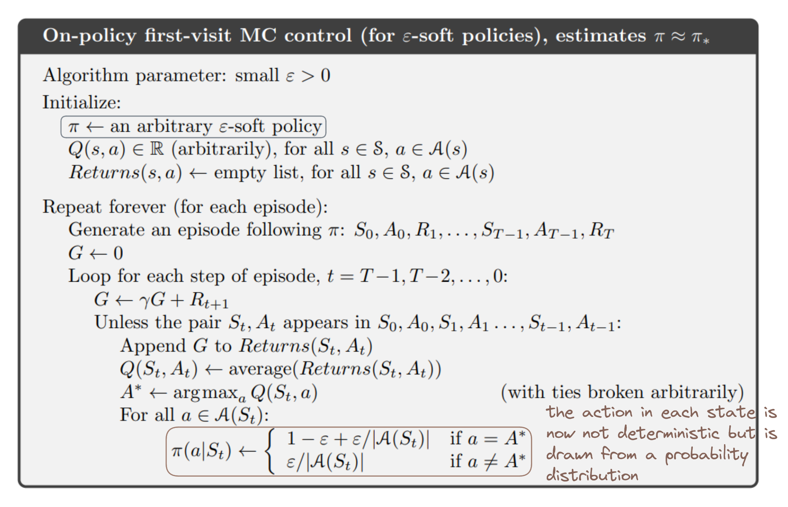{ width="700"" }

</figure>

#### 4.4 Off-policy Monte Carlo

HOWEVER, the $\epsilon-$soft policy approach still faces a drawback: it’s inherently inferior than a deterministic one (we still have a probability of choosing a non-greedy action). This is the classic problem of exploration vs exploitation tradeoff. The idea of an off-policy method is that we will use 2 policies: a behavior policy which agent uses to generate learning data, and a target policy which agent try to optimize. The target policy should a deterministic optimal policy while the behavior policy remain stochastic and more exploratory (like $\epsilon$-greedy policy).

But there’s one problem: because the returns we receive following $b$ has different expectation compared to $\pi$: $\mathbb E_b[G_t| S_t = s] = v_b(s) \neq v_\pi(s)$, so they cannot be averaged to obtain $v_\pi(s)$. To address this, we use the method of **_Importance Sampling_**, in which the returns are weighted base on the _relative probability of the trajectory_ according to the 2 policies.

To understand this concept intuitively, we begin with the formula for calculating probability of a specific trajectory - $S_t, A_t, S_{t+1}, A_{t+1}, ..., S_{T-1}, A_{T-1}, S_{T}$ - according to a specific policy - $\pi$:

$$
\begin{align*}	& \Pr \{S_t, A_t, S_{t+1}, A_{t+1},..., S_T|S_t, A_{t:T-1} \sim \pi \} \\
= & \textcolor{green}{\Pr \{S_t, A_t, S_{t+1}}\} \times \textcolor{blue}{\Pr\{S_{t+1}, A_{t+1}, S_{t+2}\}} \times... \times \textcolor{purple}{\Pr \{S_{T-1}, A_{T-1}, S_T \}} \\
= & \textcolor{green} {\pi(A_t|S_t)p(S_{t+1}|S_t,A_t)} \textcolor{blue}{\pi(A_{t+1}|S_{t+1})p(S_{t+2}| S_{t+1}, A_{t+1})}...\textcolor{purple}{\pi(A_{t-1}|S_{t-1})p(S_t|S_{t-1},A_{t-1})} \\
= & \prod_{k=t}^{T-1} \pi(A_k | S_k)p(S_{k+1}|S_k, A_k)	\end{align*}
$$

Thus the relative probability of that same trajectory but follow 2 different policies:

$$
\rho_{t:T-1} = \frac{\prod_{k=t}^{T-1} \pi(A_k | S_k) \textcolor{magenta}{p(S_{k+1}|S_k, A_k)}}{\prod_{k=t}^{T-1} b(A_k | S_k)\textcolor{magenta}{p(S_{k+1}|S_k, A_k)}} = \frac{\prod_{k=t}^{T-1}\pi(A_k|S_k)}{\prod_{k=1}^{T-1}b(A_k|S_k)}
$$

Because the dynamics of the environment is the same no matter which policy we follow, the terms $\prod_{k=t}^{T-1}p(S_{k+1}|S_k, A_k)$ are cancelled out.

We can use this ratio to transform the returns to have the right expected value. The intuition here is that, if a trajectory more frequently appears in the target policy than in it does in the behavior policy, then $\rho_{t:T-1} > 1$

$$
\mathbb E_\pi[G_t|S_t = s] = \mathbb E_b[\rho_{t:T-1}G_t|S_t=s]
$$

It’s easy to derive our update formula of the value function as:

$$
v_\pi(s) = \frac{\sum_{t \in \mathcal J(s)}\rho_{t:T(t)-1}G_t}{|\mathcal J(s)|}
$$

This kind of Importance Sampling is called Ordinary Importance Sampling, there’s also an alternative one, called Weighted Importance Sampling, which use a _weighted average_ instead of the _average of weighted returns:_

$$
v_\pi(s) = \frac{\sum_{t \in \mathcal J(s)}\rho_{t:T(t)-1}G_t}{\sum_{t \in \mathcal J(s)}\rho_{t:T(t)-1}}
$$

We finally arrive at our algorithm for Off-policy MC Control:

<figure markdown>

{ width="700"" }

</figure>

Okay, there’re a lot that need explaining here. Firstly, what are those weird updating formula? They are exactly the update formula using weighted importance sampling, but in an incremental way. Here’s the proof for those incrementally implemented formulas. If you’re not that curious, it’s totally fine to just skip this part and accept the formulas as they are.

**_<u>Hypothesis</u>_**:

Suppose that we have a sequence of returns that start from one state $G_1, G_2,..., G_{n-1}$ with their corresponding weights $W_i (i: 1 \rightarrow n-1)$, the value of that state at the $n^{th}$ update is:

$$
V_n = \frac{\sum_{k=1}^{n-1}W_kG_k}{\sum_{k=1}^{n-1}W_k}
$$

Then the updating formula would be:

$$
\begin{align*} V_{n+1} & = V_n + \frac{W_n}{C_n}(G_n - V_n) \\	\text{in which} \qquad C_n & = C_{n-1} + W_n\end{align*}
$$

**_<u>Proof</u>_**:

$$
\begin{align*} V_{n+1} & = \frac{\sum_{k=1}^{n}W_kG_k}{\sum_{k=1}^{n}W_k}\\
& = \frac{\sum_{k=1}^{n-1}W_kG_k + W_{n}G_n}{\sum_{k=1}^{n-1}W_k}\cdot\frac{\sum_{k=1}^{n-1}W_k}{\sum_{k=1}^{n}W_k} \\		 & = V_n \cdot \frac{\sum_{k=1}^{n-1}W_k}{\sum_{k=1}^{n}W_k}  + \frac{W_nG_n}{\sum_{k=1}^{n}W_k} \\		 & = V_n \left( 1 - \frac{W_n}{\sum_{k=1}^{n}W_k}\right) + G_n\frac{W_n}{\sum_{k=1}^{n}W_k} \\		 & = V_n + \frac{W_n}{\textcolor{red}{\sum_{k=1}^{n}W_n}}(G_n-V_n)		\end{align*}
$$

We can implement the red-colored sum recursively by defining $C_n = C_{n-1} + W_n$ and $C_0 = 0$. By doing so, we obtain the updating formulas exactly like those in the hypothesis.

To this point you might be confusing about what the algorithm is trying to do in the orange and yellow box. Isn’t the update formula for $W_t$ supposed to be $W_{t-1}\frac{\pi(A_t|S_t)}{b(A_t | S_t)}$, not $W_{t-1}\frac{1}{b(A_t | S_t)}$? You’re right, remember that our target policy $\pi$ is deterministic? Thus the probability of taking a certain action, in a certain state is either 1 or 0. If it’s a 1, the update formula for $W_t$ is $W_t = W_{t-1}\frac{1}{b(A_t | S_t)}$ (hence the term in the yellow box). If it’s a 0, the update formula for $W_t$ is $W_t = 0$, the action value of the previous state-action pair remains the same; and the same happen to all states preceding that state in the episode, since if just one transition step in a trajectory cannot happen when using the target policy, the whole trajectory also cannot happen.

Off-policy methods are often of greater variance and slower to converge, but is more powerful and general: on-policy methods are off-policy methods with target policy and behavior policy being the same.

### 5. Temporal Difference Learning

It turns out that there’s a universal form for update formula in RL algorithm:

$$
\text{NewEstimate} \leftarrow \text{OldEstimate} + \alpha[\text{NewEstimate} - \text{OldEstimate}]
$$

If we want to represent the estimate value of a state following MC method, which is the average of returns from that state, the update formula will be:

$$
V(S_t) \leftarrow V(S_t) + \frac{1}{n}[G_t - V(S_t)]
$$

with $n$ representing the number of returns calculated from that state so far (you can prove this update formula by yourself, or substitute $n$ with $1, 2, 3,…$ to see what you’ll receive). Now if $\alpha$ is constant, we obtain a method called Constant-$\alpha$ MC, which will not return the exact average of returns, but is convenient computationally. The idea of Temporal Difference (TD) learning is that instead of setting the $\text{NewEstimate}$ to $G_t$, whose value we have to wait till the end of every episode to calculate, we set it to $R_{t+1} + \gamma V(S_t)$, whose value can be calculate as soon as a transition is made to the next state:

$$
V(S_t) \leftarrow V(S_t) + \alpha[R_{t+1} + \gamma V(S_{t+1}) - V(S_t)]
$$

#### 5.1 TD Prediction

The algorithm for estimating $v_\pi$ based on the above update formula is called **_TD(0)_**, or **_one-step TD:_**

<figure markdown>

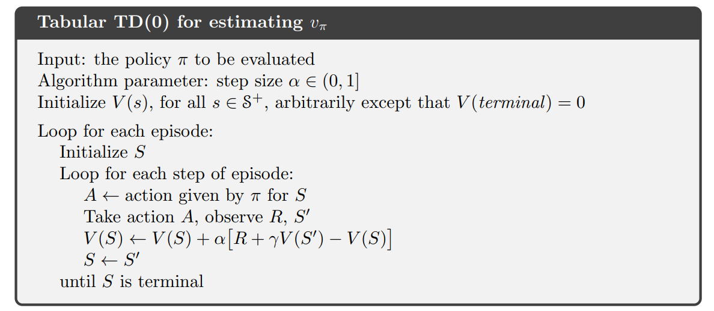{ width="700"" }

</figure>

By updating the value of each state as soon as we transit to the next state, the updates are distributed uniformly over the time interval of an episode, there are more information contains in each update (we use the updated value of preceding states to calculate for the target estimate for the succeeding states within a single episode), and we don’t need to reach the end of an episode to be able to update the value function (which is really beneficial in continuing tasks or episodic tasks with long episodes). These reasons make TD methods converge faster than MC methods in practice.

Getting confused? I feel you… Let me provide you another intuition to get you to take a grasp of the bigger picture. Here is the definition of the value function we’ve known:

$$
\begin{align*} v_\pi(s) & = \mathbb E[G_t | S_t = s] \qquad \qquad \qquad \qquad \text{ }(5)\\ & = \mathbb E[R_{t+1} + \gamma G_{t+1}|S_t = s] \\ & = \mathbb E[R_{t+1} + \gamma v_\pi(S_{t+1}) | S_t = s] \qquad (6)\end{align*}
$$

MC uses the estimate of $(5)$ as the target for updating the value function, while TD learning uses the estimate of $(6)$ as a target. The target of MC is an estimate because it only bases on _a single sample_, not a whole distribution of possible states and reward subsequent to that state (just the return, not the expected return). The target of DP is also an estimate but not for the same reason, indeed it’s because the $v_\pi(S_{t+1})$ is just a current _estimate of the value_ - $V(S_{t+1})$. While the target of TD learning is an estimate for _both reasons_ above.

#### 5.2 Sarsa: On-policy TD Control

The same story goes for TD learning methods: If we want to improve the policy somehow, we should estimate action value function instead of state value function. The same as MC control algorithm: If you try to update the value function according to the current policy, and then choose actions according a policy derived from that updated value function, then the value function will converge to the optimal value function ($Q \rightarrow q_*$):

<figure markdown>

{ width="700"" }

</figure>

Fun fact: the algorithm is called Sarsa since each update requires a quintuple of events $(S_t, A_t, R_{t+1}, S_{t+1}, A_{t+1})$.

#### 5.3 Q-learning: Off-policy TD Control

In Q-learning algorithm, the action used to calculate the target in the update formula, is the one that maximize $Q(S’,a)$, not the one selected by a greedy policy derived by our current action value function (like in Sarsa). The target policy, which can be a deterministic one, is learned dependently from that policy derived from our current value function, which is required to be more explorative. Hence this algorithm is an Off-policy one.

<figure markdown>

{ width="700"" }

</figure>

#### 5.4 Maximization Bias and Double Learning

The update formula for Q-learning has a maximization operation. In this algorithm, the maximum of estimated values is used implicitly as an estimate of the maximum (of true) value, causes something called **_maximization bias_** (consider a state with $q(s,a)$ for all $a$ is zero but the estimated value fluctuate around $0$, the _maximum of the true values_ is zero while the _maximum of the estimated values_ is positive). Take a look at this example:

<figure markdown>

{ width="700"" }

 <figcaption markdown>
 Figure 3: Comparison between Q-learning and Double Q-learning on a 4-state episodic MDP.
  </figcaption>

</figure>

This is a simple MDP. The agent always starts from $A$ and can choose between 2 actions: left or right. The right action transit it to a terminal state which gives a reward of 0. The left action transit it to another terminal state - $B$, from which it can take many actions, all of which transit the it to the terminal state with a reward sampled from a normal distribution with $\mu = -0.1$ and $\sigma = 1$. In this example, it’s optimal to always choose right. But as you can see Q-learning algorithm initially take the left action more often than the right action, and always choose it with probability much more than $5\%$, which is the probability enforced by the $\epsilon-$greedy action selection with $\epsilon = 0.1$. Why does this happen, to be specific? It’s reasonable to expect that $Q(A, r) = 0$ and $Q(A, l) = -0.1$. And you’re right for the $Q(A, r)$, but for $Q(A,l)$, something else’s happening here: because the $Q(B, a)$ for $a \in \mathcal A(B)$ fluctuate around $-0.1$, there’s a high chance that some of the action values from state $B$ are positive, thus the maximum of $Q(B,a)$ is positive. And because Q-learning always use the maximum action value as the target for value function update, $Q(A, l)$ will be positive initially ($Q(A, l) \leftarrow Q(A, l) + \alpha [R_{B} + \gamma \max_aQ(B,a) - Q(A,l)]$), thus the agents always choose left in the beginning. Not until after a plenty of steps that the action values from state $B$ approaches their true value, which is $-0.1$, because of which the agent starts to choose right more often.

The cause to this problem is using the same samples for both determining the maximizing action and to estimating its value. The solution proposed in Double Q-learning algorithm is _using 2 value functions_ and updating them independently. In each timestep, we would use one for action selection: $A_* = \max_a Q_1(s,a)$ and one for action evaluation: $Q_2(A_*) = Q_2(s, \max_a Q_1(s,a))$, and by a probability of $0.5$, we switch the role of those value functions: $Q_1(A_*) = Q_1(s, \max_a Q_2(s,a))$.

<figure markdown>

{ width="700"" }

</figure>

### 6. n-step Bootstrapping

Congrats! You’ve come such a long way. At this point, you can imagine the space of methods form a spectrum with one end is the one-step TD learning, the other end is MC, and the rest of them are methods whose update rules based on a number of rewards ranging from more than one, but less than the rest of them until termination. Those “intermediate methods” are called n-step TD learning. Below is the backup diagrams of n-step methods. A backup diagram shows how a state (or state-action pair) is updated by information transferred back from its successor states (or state-action pair), with white nodes represent states and black nodes represent actions.

<figure markdown>

 <figcaption markdown>
 Figure 4: Spectrum of RL algorithms, ranging from one-step TD to Monte Carlo.
  </figcaption>

</figure>

#### 6.1 n-step TD Prediction

The update rule of n-step TD Prediction is just as we expect: instead of accumulating the reward all the way to terminal state, we do that up to timestep $t+n$, then the rest is truncated to the value of state $S_{t+n}$:

$$
G_{t:t+n} = R_{t+1} + \gamma R_{t+2} + ... + \gamma^{n-1}R_{t+n}+ \gamma^n \textcolor{orange}{V_{t+n-1}(S_{t+n})}
$$

Here’s the complete algorithm:

<figure markdown>

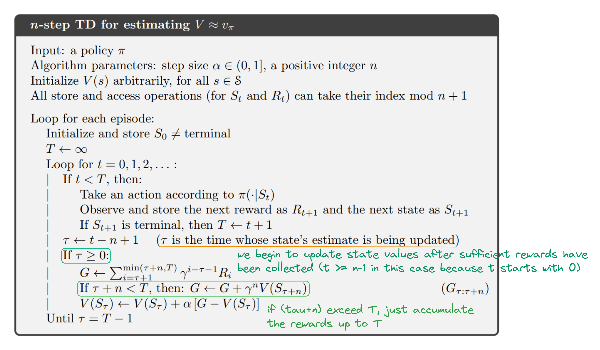{ width="700"" }

</figure>

It turns out that intermediate methods perform much better than extreme ones:

<figure markdown>

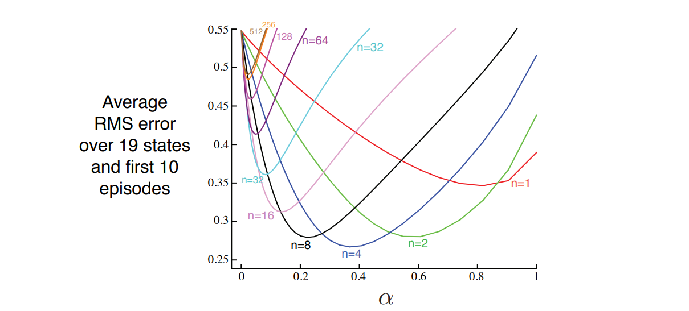

 <figcaption markdown>
 Figure 5: Performance of n-step TD methods varies with different values of $\alpha$, for different values of n, when applied to a random walk task with 19 states.
  </figcaption>

</figure>

#### 6.2 n-step Sarsa

To change the method from solving a prediction problem to a control problem, we simply switch the state value to action value, and then use an $\epsilon-$greedy policy:

<figure markdown>

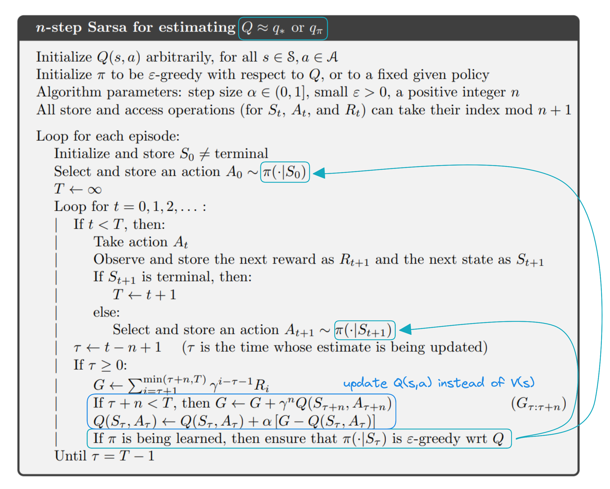{ width="700"" }

</figure>

Notice that whether we keep the policy unchanged or change it with respect to $Q$ depends on our purpose: whether we want to approximate the optimal value function and optimal policy, or just the value function for some arbitrary policy. Although our usual goal would be the former.

For more intuition about the difference between one-step and n-step Sarsa, consider this Gridworld example:

<figure markdown>

 <figcaption markdown>
 Figure 6: Comparison between one-step Sarsa and 10-step Sarsa on how much each algorithm learns in a single episode using a Gridworld example.
 </figcaption>

</figure>

This Gridworld example illustrates the enhance in speed of policy improvement in 2 algorithms: one-step Sarsa and 10-step Sarsa. In this problem, reward of all states are zero instead of the terminal state mark by G, which contains a positive reward. Suppose we initialize the value of all states to zero, and the agent take the path presented in the first panel. In one-step Sarsa, only the action immediately prior to the terminal state is strengthened, whereas in 10-step Sarsa, 10 last actions of the episode is strengthened, which leads to much faster learning.

#### 6.3 n-step Off-policy Learning

The off-policy form of n-step TD is quite straightforward: we just have to add the importance sampling ratio in order to used the data generated from $b$. But since in n-step methods, returns are constructed over n steps, so we’re only interested in the relative probability up in just those n actions. The update formula for the off-policy version of n-step TD:

$$
V_{t+n}(S_t) = V_{t+n-1}(S_t) + \alpha \rho_{t:t+n-1}(G_{t:t+n} - V_{t+n-1}(S_t)) \\
\text{with } \quad \rho_{t:h} = \prod_{k = t}^{\min(h, T-1)} \frac{\pi(A_k|S_k)}{b(A_k|S_k)}
$$

Similarly, the off-policy form for our n-step Sarsa update formula is:

$$
Q_{t+n}(S_t, A_t) = Q_{t+n-1}(S_t, A_t) + \alpha \textcolor{green}{\rho_{t+1:t+n}} (G_{t:t+n} - Q_{t+n-1}(S_t, A_t))
$$

Notice that in this formula the importance sampling ratio starts and ends 1 step later than in n-step TD. It’s because here, the action whose value is estimated has already been chosen, so the trajectory probability up to that action for the behavior policy and target policy is both 1. Furthermore, the last value we need for bootstrapping is the value of a state-action pair, not of a state, so we have to include the probability of taking that last action in the importance sampling ratio. Here is pseudocode for the full algorithm, the only difference it makes from on-policy n-step Sarsa is the addition of the importance sampling ratio:

<figure markdown>

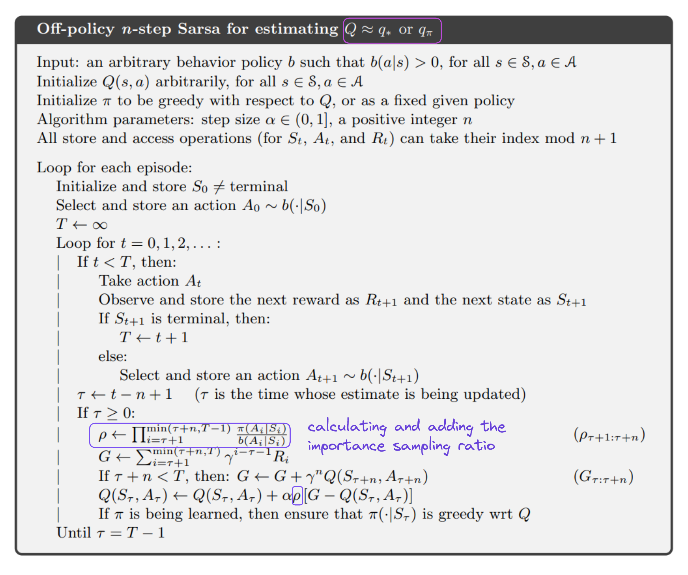{ width="700"" }

</figure>

#### 6.4 Off-policy learning without Importance Sampling: n-step Tree Backup Algorithm

Is there an off-policy method without importance sampling? We’ve seen these methods, they are Q-learning and Expected Sarsa, but they bootstrap after just one timestep. Turns out that there is a corresponding algorithm but for multiple-step case, it’s the n-step Tree Backup algorithm. How to compute the target for the update formula in this algorithm is best illustrated via a backup diagram:

If in n-step Sarsa, the target is calculated by combining the rewards collected from timestep $t+1$ to timestep $t+n$, and the value of the state-action pair $(S_{t+n}, A_{t+n})$, then in n-step Tree Backup algorithm, the target is exactly that, plus the value of the actions that are not taken, at every timestep, which are the actions left hanging in the backup tree beside.

We’ll derive the formula for the update target from this backup tree. If our algorithm is just 1-step Tree Backup, the target is the same as one in Expected Sarsa:

<figure markdown>

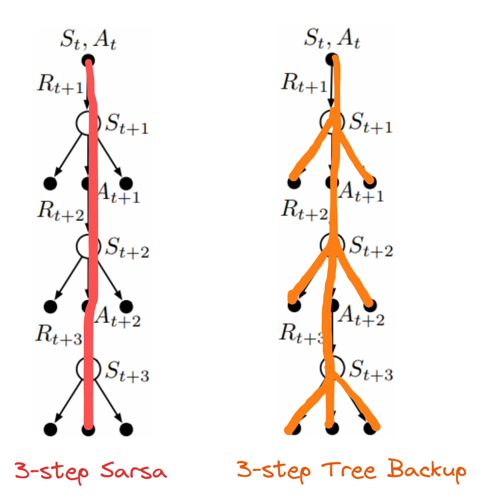{ width="500" }

 <figcaption markdown>
 Figure 7: Comparison between 3-step Sarsa and 3-step Tree Backup using a backup diagram. Nodes on the lines represent states and actions account for the value of the state-action pair at the roots.
 </figcaption>

</figure>

$$
G_{t:t+1} = R_{t+1} + \gamma \sum_a \pi(a | S_{t+1})Q(S_{t+1}, a)
$$

If our algorithm is a 2-step one, each action $a$ at the first level contribute in calculating the target with the weight of $\pi(a | S_{t+1})$, except for action actually taken. Instead, its probability, $\pi(A_{t+1} | S_{t+1})$ is used to calculate the weight of action values at the second level. Thus each action $a'$ at this level contributes with the weight of $\pi(A_{t+1}|S_{t+1})\pi(a’|S_{t+2})$:

$$
\begin{align*} G_{t:t+2} & = R_{t+1} + \gamma \sum_{a\neq A_{t+1}} \pi(a | S_{t+1})Q(S_{t+1}, a) + \gamma \pi(A_{t+1} | S_{t+1}) \left [R_{t+2} + \gamma \sum_{a'}\pi(a'|S_{t+2})Q(S_{t+2}, a')\right] \\
& = R_{t+1} + \gamma \sum_{a\neq A_{t+1}} \pi(a | S_{t+1})Q(S_{t+1}, a) + \gamma \pi(A_{t+1} | S_{t+1})G_{t+1: t+2}
\end{align*}
$$

This recursive form is really helpful since we can form a more general update target formula for n-step Tree Backup algorithm, which is:

$$
G_{t:t+n} = R_{t+1} + \gamma \sum_{a\neq A_{t+1}} \pi(a | S_{t+1})Q(S_{t+1}, a) + \gamma \pi(A_{t+1} | S_{t+1})G_{t+1: t+n}
$$

The complete pseudocode for the algorithm is presented in the box below, it’s pretty similar to n-step Sarsa, only the update target is computed differently:

<figure markdown>

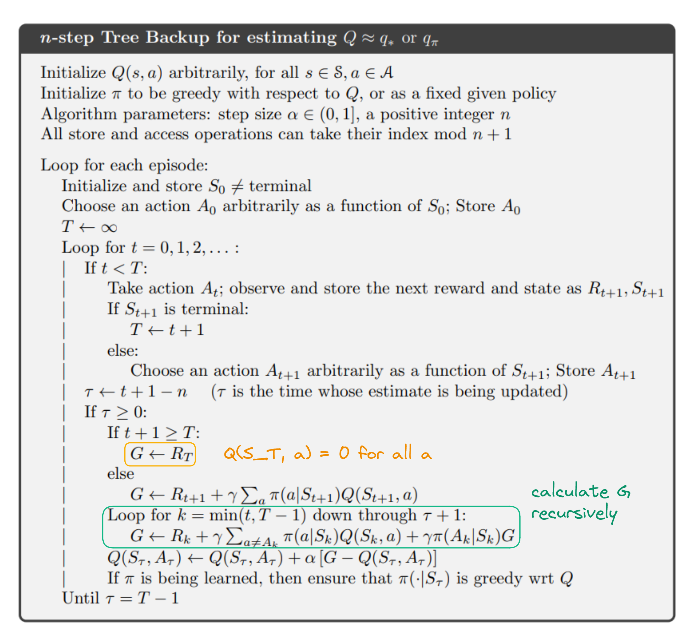{ width="700"" }

</figure>

### 7. Problems and Extension regarding Tabular Methods

#### 7.1 Dyna: Integration of Learning and Planning

If we categorized all of the above algorithms, we’ve got _model-based_ (Dynamic Programming, in which we need the model of the environment to be able to update the value function) and _model-free_ (Monte Carlo, Temporal Difference, in which we just need the data sampled directly from the environment) reinforcement learning. The process of updating the value function and improving the policy via interactions with the _real environment_ or the _model_ is called _learning_ and _planning_ respectively.

When planning is done online (while interacting with the environment), there are a lot of problems need considering: how to update the model according to the continuously collected data from interaction with the real environment, how to choose state-action to update when interacting with the model,… Dyna-Q is a simple model demonstrates how the 2 processes of learning and planning is done in every timestep:

<figure markdown>

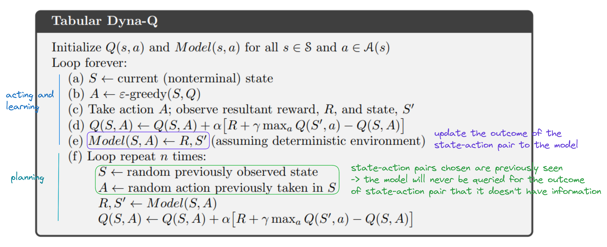{ width="700"" }

</figure>

You can observe that for Dyna-Q, real experience serves 2 purposes: update value function and/or policy (direct learning) and update the model (the model is later used for planning, which is call indirect learning). The algorithm used for direct learning is Q-learning, and for planning is also Q-learning, but the state-action pairs are randomly sampled from seen ones.

This model fit well to problems that the interaction between the agent and environment is limited, or that there’s a high cost doing so. Integrating planning into the process of learning will probably takes the agent far fewer episodes to reach the optimal performance.

#### 7.2 When the model is wrong

One problem arises when planning is that sometime the model is wrong. This can be caused by several reasons: the environment is stochastic and a small number of samples are observed; the model is learned by function approximation in which the function updated is either chosen to be too simple that it cannot represent the environment accurately, or too complex so that it failed to generalize; the environment changes over time;… This failure in constructing the model most of the time will lead to suboptimal policies due to planning. The fixing of the environment will lead to 2 scenarios - either the environment becomes _better_ or _worse_ for the current policy. Let’s take a look at these example:

<figure markdown>

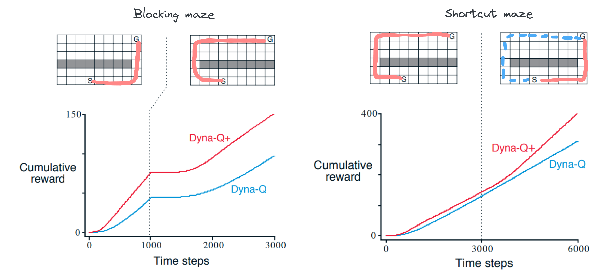

 <figcaption markdown>
 Figure 8: Examples of when the model changes for the worse (Blocking maze) and changes for the better (Shortcut maze)
 </figcaption>

</figure>

The task of the agent is to find the shortest way from S to G. The first panel describes the scenario where the optimal path is blocked after the model is relearned (aka environment changes to become worse). The second describes the scenario where there’s an additional shortcut when the model is relearned. Dyna-Q+ is fundamentally Dyna-Q with additional bonus in behavior policy that encourage exploration. In the former scenario, both our Dyna-Q agents can relearn a better policy after they’ve been wandering around the right corner (the part where the graph flattens out). This happens because following a policy that they are so optimistic about leads the agents to new discoveries and updates that help them in finding out that the current policy is “not that optimal” so that they work hard to find an optimal one. But in the latter scenario, the issue becomes complicated: the Dyna-Q agent doesn’t realize that there’s a better policy since the cost for discovering new policy is so large that it’s safer for the agent to stay with the current one (in order to discover the optimal policy, the agent has to make a bunch of exploration steps into low-value states), however the Dyna-Q+ manages to find such policy since the bonus it’s given for exploration at some point outweighs the accumulative reward it receives for sticking with the current policy.

What gives Dyna-Q+ this exploration ability is that it’s given a bonus reward for each state-action pair encountered:

$$
r' = r+k\sqrt{\tau}
$$

where $\tau$ is the number of time steps that the $s-a$ pair hasn't been tried.

#### 7.3 Prioritize Sweeping

Prioritize Sweeping is an updating strategy in planning, in which the states being updated are prioritized base on there predicted change in value. One way to achieving this is to work backward from goal states, but to be more general, it is to work backward from states whose values are just changed. The full algorithm is presented below:

<figure markdown>

{ width="700"" }

</figure>

This approach is call backward focusing. There is another approach called forward focusing where priority is determined based on how easily a state can be reached from states that are frequently visited under our current policy.

#### 7.4 Trajectory Sampling

Trajectory Sampling is a strategy in distributing updates where instead of exhaustive sweep through the entire state space (like in DP), you update them according to an on-policy distribution, which is the distribution of states and actions encountered when following the current policy. This is beneficial for problems where the state space is too big that it’s computationally expensive to sweep through all of them. Instead, there are some states that need more focus on, such as those being visited frequently following our current policy.

Here is the result of a small experiment. The environment is designed so that each state-action pair can lead to $b$ possible next state equally ($b$ is called the branching factor). On all transitions there is a 0.1 chance of reaching the terminal state. And the expected reward of all transition is sampled from a Gaussian distribution with mean 0 and variance 1.

<figure markdown>

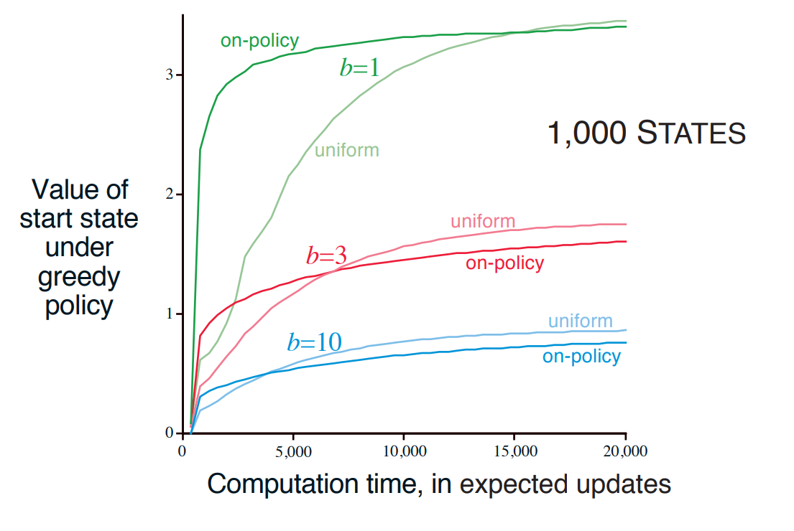

 <figcaption markdown>
 Figure 9: Relative performance between uniform sampling and on-policy sampling for a 1,000-state MDP with different branching factors.
 </figcaption>

</figure>

While being beneficial for problems with a large state space in which just a small subset is visited frequently, trajectory sampling can be detrimental in the sense that it can end up causing the same states to be updated again and again. This drawback can be seen from the graph where the performance of uniform sampling is better than on-policy sampling asymptotically.

## Part 2: Case Study

Here’s a [notebook](https://github.com/baotram153/RL-case-studies/blob/main/Tabular-Methods/Classical-RL-Algos.ipynb){ target="\_blank" } that contains the code for all the algorithms mentioned above. In these experiments, we used 4 toy environments (Frozen Lake - deterministic, Frozen Lake - slippery, Cliff Walking and Taxi) provided by `gymnasium` - a library that provides API for lots of useful Reinforcement Learning environments. `Frozen Lake` and `Cliff Walking` are environments where the agent has to reach the goal (a present/cookie) without breaking the ice/falling off the grid, while `Taxi` is an environment where our agent (a taxi) navigates to passengers, picks them up and delivers them to the building.

If there’s a mistake that I’ve made, or there is something in the notebook that confuses you, feel free to reach out to me!

There are a few things that you should notice:

### 1. Sarsa vs Q-learning in Cliff Walking

Sarsa chose the safer path than Q-learning. This happens because the state-action values calculated by Sarsa take into account all possible states and actions from the policy and the environment dynamics, this results in this algorithm concerning about both the reward of reaching the goal and the penalty of falling off the cliff, while the state-action values calculated by Q-learning only takes into account the actions that maximize the reward, hence the agent chose the shortest path to get to the goal. In other words, agent learned with Sarsa algorithm chose the path that maximized expected return, while agent learned with Q-learning algorithm chose the path that maximized greatest possible return.

<figure markdown>

<!--  -->
<video width="700" controls>
  <source src="images/sarsa.mp4" type="video/mp4">
</video>
 <figcaption markdown>
 Figure 10: The optimal policy found by SARSA in Cliff Walking environment.
 </figcaption>

</figcaption>

</figure>

<figure markdown>

<!--  -->

<video width="700" controls>
  <source src="images/q_learning.mp4" type="video/mp4">
</video>
 <figcaption markdown>
 Figure 11: The optimal policy found by Q-learning in Cliff Walking environment.
</figcaption>
</figure>

### 2. Value Iteration vs Policy Iteration

It’s easy to observe that Value Iteration yields better result than Policy Iteration, since it cancels out a lot of redundant iterative steps of approaching the truth value of states following a suboptimal policy.

<figure markdown>

 <figcaption markdown>
 Figure 12: Number of steps using Value Iteration and Policy Iteration, average over 5 experiments
</figcaption>

</figure>

<figure markdown>

 <figcaption markdown>
 Figure 13: The Frozen Lake environment and the corresponding Q-table learned by the Value Iteration algorithm. The direction of the arrow and the color of each state in the above graph represent the optimal action (action which has the highest value) and its corresponding value in each state.
 </figcaption>

</figure>

### 3. How many steps are optimal for n-step bootstrapping algorithms?

The below plot shows the performance of n-step SARSA and n-step Tree Backup algorithms with different number of bootstrap steps. We can see that the step n set at 4 or 8 is optimal for both algorithms, in the Cliff Walking environment

<figure markdown>

![Figure 14: Performance of n-step Tree Backup with n = [2, 4, 8, 16] in Cliff Walking environment.](images/image2.png)

 <figcaption markdown>
 Figure 14: Performance of n-step Tree Backup with n = [2, 4, 8, 16] in Cliff Walking environment.
 </figcaption>

</figure>

<figure markdown>

![Figure 15: Performance of n-step Sarsa with n = [2, 4, 8, 16] in Cliff Walking environment.](images/image3.png)

 <figcaption markdown>
 Figure 15: Performance of n-step Sarsa with n = [2, 4, 8, 16] in Cliff Walking environment.
 </figcaption>

</figure>

### 4. The best algorithm for each environment (not include n-step bootstrapping algorithms)

We can see that all the algorithms have comparative performance to one another in our toy environments such as Cliff Walking or Taxi, except for Monte Carlo. We can see from the graph “Steps until terminated” that Q-Learning is the fastest to converge, and Monte Carlo is the slowest. However, in different hyperparameter and environment settings, this may not remain true. Double Q-Learning algorithm may converge faster in more complex environment since it addresses the issue of positive bias made by Q-Learning. But in easy environments, it performs worse since there are two Q tables to be updated.

<figure markdown>

 <figcaption markdown>
 Figure 16: Comparison between different Reinforcement Learning algorithms in Cliff Walking environment.
 </figcaption>

</figure>

<figure markdown>

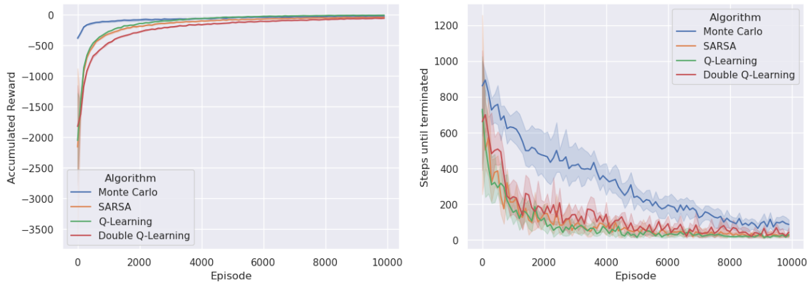

 <figcaption markdown>
 Figure 17: Comparison between different Reinforcement Learning algorithms in the Taxi environment.
 </figcaption>

</figure>

### 5. The strange case of Monte Carlo’s gamma fine-tuning

While running the experiment, we’ve observed Monte Carlo’s strange behaviors: its inability to converge although the greedy hyperparameter $\epsilon$ was set to be very high. This happened because the discounted factor ($\gamma$) was so small ($0.9$) that the accumulated penalty for exploring around (the agent had greater risk of falling off the cliff, which gave a penalty of -100 in return) was much worse than standing at the same state or repeatedly visiting the same states (the maximum number of timesteps is 1000, so the accumulative penalty of standing at the same state was $\frac{0.9^{1000}\times(-1) - 0.9^0 \times (-1)}{0.9 - 1} \approx -10$), which was approximately the same as wandering around about 60 timesteps, and then entering the terminal state?!  To address this problem, we had to increase the gamma ($\gamma$) hyperparameter to $0.99$ or $1$, and the algorithm converged perfectly.

<figure markdown>

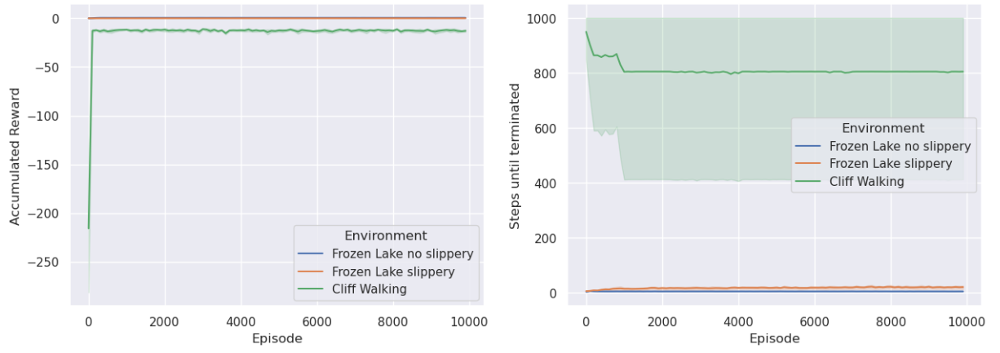

 <figcaption markdown>
 Figure 18: Monte Carlo cannot converge in Cliff Walking environment when _discount factor_ (gamma) is set to $0.9$.
 </figcaption>

</figure>

<figure markdown>

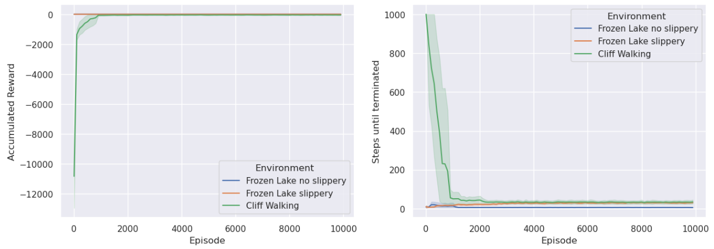

 <figcaption markdown>
 Figure 19: Monte Carlo algorithm converges in Cliff Walking environment when _discount factor_ (gamma) is set to $1$.
 </figcaption>

</figure>

This is also one of the biggest problems of Reinforcement Learning: the time-consuming task of hyperparameter tuning: just a small change in hyperparameter can make the algorithm to be extremely unstable.

## Conclusion

We’ve gone a pretty far way through different classical Reinforcement Learning algorithms, and applied them in some toy environments like Frozen Lake, Cliff Walking and Taxi. We‘ve also learned about the trade-offs between those algorithms, between on-policy and off-policy methods, and between exploration and exploitation in finding the optimal solution; about different strategies to improve the efficiency of exploration and updating of state/action values; and about the drawbacks of Reinforcement Learning algorithms in general and how to avoid (well, a part of) them. We hope that this article will invoke your enthusiasm and eagerness to explore more about the subject matter.

If you want to discuss about certain parts of the article, or interesting RL ideas, feel free to contact me via email `tramdang7907129@gmail.com`

## References

[1] R. S. Sutton and A. Barto, _Reinforcement learning : An introduction_. London: The Mit Press, 2018.

[2] Gymnasium documentation. (n.d.). Retrieved November 7, 2024, from https://gymnasium.farama.org
